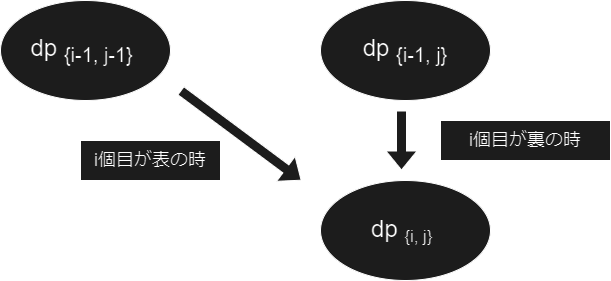
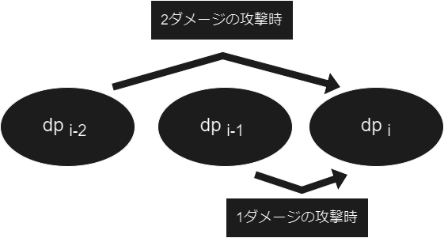

## 本編に入る前に

DP を学びたいと思ってる人向けにおススメの DP のコンテストをここに貼っておきます。個人的にこれに勝る DP の問題集は無いです。 DP の奥の深さを知ることが出来るので時間があったら A 問題から順にやってみてください。 ( 分からないところがあったら through もしくは a01sa01to に聞いて下さい。基本答えられるはずです。 )

<https://atcoder.jp/contests/dp>

## DPの復習

まずは DP についておさらいします。DP ( Dynamic Programming ) とは特定の問題をそれより小さい部分問題に分けて解くアルゴリズムです。復習として簡単なカエルの DP と少し応用されたナップサック DP を見てみましょう。

> ### [Frog 1 ( EDPC-A )](https://atcoder.jp/contests/dp/tasks/dp_a)
>
> $N$個の足場があります。足場には $1,2,...,N$ と番号が振られており、各$i$に対して足場の高さは $h_i$ です。最初、足場 $1$ にカエルがいます。カエルは次の行動で以下の操作を何回か繰り返し、足場 $N$ までたどり着こうとしています。
>
> - 足場 $i$ にいる時、足場 $i+1$ または $i+2$ へジャンプする。ジャンプ先の足場の高さを $j$ とすると、コスト $|h_i-h_j|$ を支払う。
>
> カエルが足場 $N$ にたどり着くまでに支払うコストの総和の最小値を求めてください。
>
> #### 制約
>
> - $2 \leq N \leq {10}^5$
> - $1 \leq h_i \leq {10}^4$

これは今いる足場を $i$ とすると、『足場 $i$ は足場 $i-1$ or 足場 $i-2$ から一度の操作を経て訪れる 』と表せる為、DP で解くことが出来ます。$dp[i]$ を 『i番目の足場にいる時のコストの最小値』とすると、以下の式で表せます。

$$dp[i] = min( dp[i-1]+abs(h[i]-h[i-1]), dp[i-2]+abs(h[i]-h[i-2]) )$$


$i = 0, 1$ の時は配列外参照になる為、DP の初期値はハードコーディングしてあげてください。この問題で言えば、$dp[0] = 0, dp[1] = abs(h[0]-h[1])$ になります。( 1番目の足場は開始地点なので $0$, 2番目の足場は1番目の足場から来る遷移しか存在しないので $abs(h[0]-h[1])$ )

実際にこの問題は以下のプログラムで解くことが出来ます。

:::details[ACコード]

```cpp
#include <bits/stdc++.h>
using namespace std;
using ll = long long;

int main() {
    ll n; cin >> n;
    vector<ll> h(n), dp(n,1e14);
    for(ll i=0; i<n; i++) cin >> h[i];
    dp[0] = 0, dp[1] = abs(h[0]-h[1]); // 初期値設定
    for(ll i=2; i<n; i++) {
        dp[i] = min(dp[i-1]+abs(h[i]-h[i-1]), dp[i]);
        dp[i] = min(dp[i-2]+abs(h[i]-h[i-2]), dp[i]);
    }
    cout << dp[n-1] << '\n';
    return 0;
}
```

:::

> ### [Knapsack 1 ( EDPC-D )](https://atcoder.jp/contests/dp/tasks/dp_d)
>
> $N$個の品物があります。品物には $1,2,...,N$ と番号が振られており、各 $i$ について、品物 $i$ の重さは $w_i$ で、価値は $v_i$ です。
>
> 太郎君は、 $N$ 個の品物のうちいくつかを選び、ナップサックに入れて持ち帰ることにしました。ナップサックの容量は $W$ であり、持ち帰る品物の重さの総和は $W$ 以下で投げれば行けません。
>
> 太郎君が持ち帰る品物の価値の総和の最大値を求めてください。
>
> #### 制約
>
> - $1 \leq N \leq 100$
> - $1 \leq W \leq {10}^5$
> - $1 \leq w_i \leq w$
> - $1 \leq v_i \leq {10}^9$

これは DP の中でも特に有名問題である ナップサックDP というものです。カエルの DP と同様に考えてみましょう。

カエルの DP にならうと、$dp[i]$ を『$i$ 番目の品物まで考慮した時のナップサックに入る最大価値』としてあげることになります。ただこれでは、ナップサックの容量に関する情報が抜けており、いつ満杯になってしまうかが分かりません。

その為、DP をもう1次元追加してあげて $dp[i][j]$ を『 $i$ 番目の品物まで考慮した時の重さの総和が $j$ の時のナップサックに入る最大価値』としてあげることで、DP が重さに関する情報を持つことが出来ます。

こうすると、実は以下の式の様に$dp[i][j]$ はそれより小さい部分問題に帰着出来ます。

$$dp[i] = max( dp[i-1][j], dp[i-1][j-w[i]]+v[i] )$$


後はカエルの DP と同じように i = 0の時は初期値を指定してあげるだけです。実際にこの問題は以下のプログラムで解くことが出来ます。

:::details[ACコード]

```cpp
#include <bits/stdc++.h>
using namespace std;
using ll = long long;

int main() {
    ll n, W; cin >> n >> W;
    vector<ll> w(n+1), v(n+1);
    for(ll i=1; i<=n; i++) cin >> w[i] >> v[i];
    // dp[i][j] : i番目の品物まで見て重さの総和がjの時の最大価値
    vector dp(n+1,vector<ll>(W+1,-1e16));
    dp[0][0] = 0; // 初期値は (0,0) だけ 0 , 他は小さい値
    for(ll i=1; i<=n; i++) {
        for(ll j=0; j<=W; j++) {
            dp[i][j] = max(dp[i][j], dp[i-1][j]);
            if( j-w[i] >= 0 ) dp[i][j] = max(dp[i][j], dp[i-1][j-w[i]]+v[i]);
        }
    }
    ll ans = 0;
    for(ll i=0; i<=W; i++) ans = max(ans, dp[n][i]);
    cout << ans << endl;
    return 0;
}
```

:::

このように DP は初期値とある $i$ における答えを $i$ より小さい部分問題から求めることが出来れば、それを小さい方から順に行うことで解くことが出来ます。凄いです。

とりあえず、**$i$ 番目の答えが $1$ から $i-1$番目の答えから導ける** 時はまず DP を疑いましょう。

## 確率DP

確率DP は 高校数学の確率漸化式とほぼ同義です。


高校数学で上記のようなものを見たことがあると思います。$A$ を $dp$ と捉えれば、以下の式で表せます。

$$dp[n+1] = p[n]×dp[n] + p[n-1]×dp[n-1]$$

先ほどのカエルの DP の式に似てますね。実際に、現在より小さい部分問題から現在の問題を解いているという意味でカエルの DP とやっていることは同じです。違うのは何を扱っているかだけで、今回は確率を扱っているというだけです。

**『DPは習うより慣れろ』** なので、早速問題を見てみましょう。

※ 以下の問題は難しいので解ける必要はありません。確率DPの雰囲気を知りましょう！

> ### [Coins ( EDPC-I )](https://atcoder.jp/contests/dp/tasks/dp_i)
>
> $N$ 枚のコインがあり、コイン $i$ は確率 $p[i]$ で表、$1-p[i]$ で裏が出ます。全てのコインを投げた時、表が出たコインの数の方が多い確率を求めてください。
>
> #### 制約
>
> - $N \leq 2999$
> - $N$ は奇数

まず、DP 抜きで考えてみると、各コインが表か裏かをbit全探索すれば出来そうです。求める答えは、『表が多い時の確率の総和』になるので、以下のコードが作れます。

:::details[bit全探索のコード]

```cpp
#include <bits/stdc++.h>
using namespace std;
using ll = long long;
using ld = long double;

int main() {
    // 小数第10位まで出力
    cout << setprecision(10) << fixed;
    ll n; cin >> n;
    vector<ld> p(n);
    for(ll i=0; i<n; i++) cin >> p[i];

    ld ans = 0.0;
    for(ll i=0; i<(1LL << n); i++) {
        ll omote = 0;
        ld cand = 1.0;
        for(ll j=0; j<n; j++) {
            // i の j 桁目の bit が立ってたら表、ないなら裏
            if( i & (1LL << j) ) {
                cand *= p[j];
                omote++;
            }
            else cand *= 1-p[j];
        }
        // 表の数 > 裏の数
        if( omote > n-omote ) ans += cand;
    }
    cout << ans << '\n';
    return 0;
}
```

:::

ただこの解法は $N \leq 20$ の時は解けますが、$N \leq 2999$ では bit全探索は $O(2^NN)$ なので TLE したり、$2^N$ がオーバーフローして WA が出たりします。

ここで $dp[i][j]$ を 『 $i$ 個目のコインまでを考慮して、表が $j$ 回出た時の確率 』として考えると、部分問題に帰着出来るので DP で解くことが出来ます。DP の遷移式は以下の様になります。

$$dp[i][j] = p[i]×dp[i-1][j-1] + (1-p[i])×dp[i-1][j]$$



今回求めるものは何かというと、表が裏より多く出る時の確率です。表が $i$ 枚存在する時、裏は $N-i$ 枚あるので、表の枚数が裏の枚数より多い場合と言うのは、$i > N-i$ すなわち $i > \frac{N}{2}$ の時になります。

よって今回求めるものは $\Sigma_{i=N/2+1}^{N}dp[N][i]$ となります。

後はナップサック DP と同じように i = 0の時は初期値を指定してあげるだけです。今回は確率 DP なので、$dp[0][0] = 1.0$ としてあげます。
すると実際にこの問題は以下のプログラムで解くことが出来ます。

:::details[ACコード]

```cpp
#include <bits/stdc++.h>
using namespace std;
using ll = long long;
using ld = long double;

int main() {
    // 小数第10位まで出力
    cout << setprecision(10) << fixed;
    ll n; cin >> n;
    vector<ld> p(n+1);
    for(ll i=1; i<=n; i++) cin >> p[i];
    
    // dp[i][j] : i番目のコインまで見て表がj枚出た時の確率
    vector dp(n+1,vector<ld>(n+1,0.0));
    dp[0][0] = 1.0; // 初期値設定
    for(ll i=1; i<=n; i++) {
        for(ll j=0; j<=n; j++) {
            if( j-1 >= 0 ) dp[i][j] += p[i]*dp[i-1][j-1];
            dp[i][j] += (1-p[i])*dp[i-1][j];
        }
    }
    ld ans = 0.0;
    for(ll i=n/2+1; i<=n; i++) ans += dp[n][i];
    cout << ans << endl;
    return 0;
}
```

:::

## 期待値DP

期待値DP はその名の通り、期待値を対象とした DP です。先ほどの確率DP と同じで、カエルのDPで扱う部分が期待値になった、ただそれだけです。

ここで期待値についておさらいします。期待値とは、変量 $X$ の要素 $x_1,x_2,...,x_N$ と その出現確率 $p_1,p_2,...,p_N$ が存在する時の $\Sigma_{i=1}^{N}x_ip_i$ のことです。よく 期待値 (Expected Value) の頭文字を取って $E$ で表現されます。

サイコロの目の期待値を求めてみると、$E = \Sigma_{i=1}^{6} \frac{1}{6}×i = \frac{21}{6} = 3.5 $ となります。今回はこれをDP で扱っていきます。これも問題を見た方が手っ取り早いので早速問題に移ります。

> ### [Critical Hit ( ABC280-E )](https://atcoder.jp/contests/abc280/tasks/abc280_e)
>
> 体力が $N$ であるモンスターが $1$ 体います。
>
> 高橋君はモンスターに対し、モンスターの体力が $1$ 以上残っている限り繰り返し攻撃を行います。
>
> 高橋君は $1$ 回の攻撃で、$\frac{P}{100}$ の確率でモンスターの体力を $2$ 減らし、$\frac{100-P}{100}$　の確率でモンスターの体力を $1$ 減らします。
>
> モンスターの体力が $0$ 以下になるまでに行う攻撃回数の期待値を mod $998244353$ で出力してください。
>
> #### 制約
>
> - $1 \leq N \leq 2×{10}^5$
> - $0 \leq P \leq 100$

… mod $998244353$ ってなんだ…？

と思った方もいるかもしれません。これは『想定される答えが非常に大きい値が関わりオーバーフロー or 誤差が出てしまう為、答えを $998244353$ で割った余りを答えてください』という意味です。

答えが大きくなる系の問題は、$998244353$ の時と $1000000007$ の時がとても多いです。なんでこの2つなのかは理由がありますが、説明すると長くなるので省きます。この2つが素数ってことだけ覚えといてください。

今回は AtCoder Library の modint998244353 を用います。これは合同式においても四則演算を出来る用に改良されたものなので、普通の long long と同じように使えます。合同式の割り算は初見だとかなり気持ち悪いと思いますが、今回はそういうものだと思ってください。( 時間があれば合同式の割り算について少し解説するかも…？ )

では問題に移ります。

今回の問題の設定は何か見覚えがある気がします。そうです、冒頭のカエルの DP に似てますね。今回は現在考えている問題より2個前までの部分問題を考えれば解けそうな匂いがぷんぷんします。

すると DP を考えたくなります。実際に $dp[i]$ を『モンスターの体力が $i$ の時に、そのモンスターを倒すのに必要な攻撃回数』とすると、以下の式で表すことが出来ます。

$$dp[i] = \frac{P}{100}×(dp[i-2]+1) + \frac{(100-P)}{100}×(dp[i-1]+1)$$



カエルの DP 同様に、$i = 0, 1$ の時は配列外参照になる為、DP の初期値はハードコーディングしてあげてください。この問題で言えば、$dp[0] = 0.0, dp[1] = 1.0$ になります。( 体力 $0$ のモンスターは死んでいるので $0$, 体力1のモンスターはどんな攻撃でも次で必ず死ぬので $1$ )

実際にこの問題は以下のプログラムで解くことが出来ます。

:::details[ACコード]

```cpp
#include <bits/stdc++.h>
using namespace std;
using ll = long long;
using ld = long double;
// ※ AtCoderのコードテスト上だと動きます
#include <atcoder/all>
using namespace atcoder;
using mint = modint998244353;

int main() {
    ll n, p; cin >> n >> p;
    // dp[i][j] : 体力iのモンスターを倒すのに必要な攻撃回数の期待値
    vector<mint> dp(n+1,0);
    dp[0] = 0, dp[1] = 1; // 初期値設定
    mint p1 = mint(100-p)/100, p2 = mint(p)/100;
    for(ll i=2; i<=n; i++) {
        dp[i] = p2*(dp[i-2]+1) + p1*(dp[i-1]+1);
    }
    cout << dp[n].val() << endl;
    return 0;
}
```

:::

## まとめ

まとめとして、確率 DP や期待値 DP という名前から難しそうだなーと思うかもしれませんが、やってることは普通の DP で扱うものが確率や期待値になったと言うだけです。

とりあえず DP を用いたい時は

1. 初期値がすぐ求まる
2. 現在より小さい部分問題から現在の問題が解ける

この2点を意識して解いてみてください！

## 演習問題

頑張って解いてみましょう！巡回するので分からないところがあったら言ってください。

### 確率 DP

#### [ABC275-E Sugoroku4](https://atcoder.jp/contests/abc275/tasks/abc275_e)

:::details[Hint1: DP の持ち方]

他の DP にならうと $dp[i]$ を『 $i$ 回の操作でマス $N$ に到達する期待値』になります。ただこれだと、今現在どこのマスにいるかが分からず、遷移が書けません。

その為、$dp[i][j]$ を『 $i$ 回の操作でマス $j$ に到達する期待値』として持ってみましょう。
$i$ 回の操作でマス $j$ に到達することが、$i-1$ 回、またはそれより前の $DP$ の結果を用いて遷移を表現出来たら勝ちです！

:::

:::details[Hint2: DP の遷移]

今までは貰う DP で書いていましたが、今回は配る DP で書くと分かり易いので、配る DP で書いてみましょう。

Hint1 のように DP を持つと、$i$ 回目後に目 $t$ を出した時、以下のことが言えます。それぞれの行先が存在するか check しながらプログラムを書いてみましょう。

- $j+t \leq N$ ならば マス $j+t$ に到達する。
- それ以外ならば マス $N-(t-(N-j))$ に到達する。


:::

### 期待値 DP

#### [ABC280-E Critical Hit](https://atcoder.jp/contests/abc280/tasks/abc280_e)

※ 先ほどの解説を見て理解しながら AC してみましょう。

#### [ABC194-D Journey](https://atcoder.jp/contests/abc194/tasks/abc194_d)

:::details[Hint1: DP の持ち方]

Comming Soon ...

:::

:::details[Hint2: DP の遷移]

Comming Soon ...

:::
