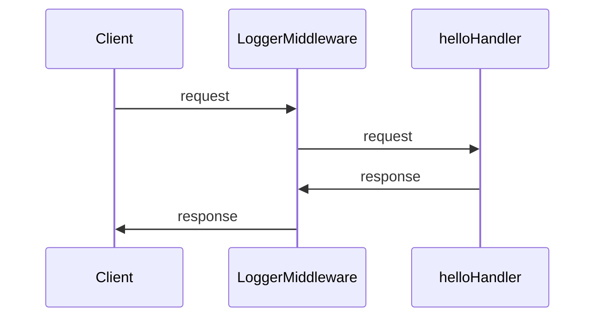

## おさらい

今までNode.jsに素のSQLを書いて、データベースとのやりとりをしてきました。
そしてサーバーで取得したデータをサーバー側で無理やり組み立てて、text/html形式で返していました。
これは基礎を学ぶという点ではいい方法ですが、実際にはライブラリをさらに使ったり、そもそも違う言語を使ったりします。

今回からは、Goを使ったより実践的なバックエンド開発をしていきます。
(夏休み前最後の講習なので、再会は9月末になります。)

## Go

GoはGoogleが開発したプログラミング言語です。GoはC言語のような低レイヤーな処理を行うことができるのに、Pythonのようなプログラミングの容易さを持っています。
シンプルな言語設計をしており、とても読みやすく書きやすい言語です。

いろいろなOSSでも採用されており、DockerやKubernetesがGoで書かれています。

### Goのインストール

Goのインストールは[こちら](https://golang.org/doc/install)を参考にしてください。

Goはスクリプト型の言語ではなく、コンパイル型の言語です。
そのため、今までのJSのプログラミングのようなカジュアルさはなく、保守性や安全性を重視しています。

ポインタを使った変数の扱いや、パッケージシステムなどがJSにない機能なのでもしかしたら難しいかもしれません。

### Goのプロジェクトを作成しよう

Goのプロジェクトを作成するには、まずはディレクトリを作成します。

作ったらそのディレクトリに移動して、`go mod init <module-name>`を実行します。
`<module-name>`は別に何を書いてもいいのですが、なるべくGitHubのリモートリポジトリ名と同じにしておいたほうがいいです。
例えば、GitHubのリモートリポジトリ名が`webken-2023`だったら、`go mod init github.com/saitamau-maximum/webken-2023`とします。

これでGoのプロジェクトが作成できました。

### GoでHello, World!を出力してみよう

`main.go`を作成して、以下のコードを書いてください。

```go
package main

import "fmt"

func main() {
    fmt.Println("Hello, World!")
}
```

これで、`go run main.go`を実行すると、`Hello, World!`と表示されるはずです。

これだけで、Goのプログラムが実行できます。

`fmt`は誤解を恐れずにいうと、C++でいう`iostream`のようなものです。

### Goで関数を作ってみよう

Goで関数を作るには、`func`というキーワードを使います。

`main.go`を作成して、以下のコードを書いてください。

```go
package main

import "fmt"

func main() {
    hello("Maximum")
}

func hello(name string) {
    fmt.Printf("Hello, %s!", name)
}
```

これで、`go run main.go`を実行すると、`Hello, Maximum!`と表示されるはずです。

### Goで変数を使ってみよう

Goで変数を使うには、`var`というキーワードを使います。

`main.go`を作成して、以下のコードを書いてください。

```go
package main

import "fmt"

func main() {
    name := "Maximum" // var name string = "Maximum"と同じ
    hello(name)
}

func hello(name string) {
    fmt.Printf("Hello, %s!", name)
}
```

これで、`go run main.go`を実行すると、`Hello, Maximum!`と表示されるはずです。

Goのアナライザはとても頭がいいので、変数の型を書かなくてもある程度推論してくれます。

### 値渡しと参照渡し

値渡しと参照渡しについて、Webでも競プロでも触れたことがなかったので、ここで触れておきます。

値渡しとは、変数の値をコピーして渡すことです。

例えばJSは値渡しが基本の言語なので、以下のようなコードを書くと、`a`の値は変わりません。

```js
let a = 1;

function addOne(num) {
  num += 1;
}

addOne(a)

console.log(a); // 1
```

そのため、JSでは以下のように書く必要があります。

```js
let a = 1;

function addOne(num) {
  return num + 1;
}

a = addOne(a) //一度addOneに変数の値をコピーして渡し、addOneの返り値をaに代入することで更新する

console.log(a); // 2
```

これでは、変数の値を更新するのに面倒ですし、コピーするのでメモリの使用量も増えます。

Goでも同じ書き方はできて

```go
package main

import "fmt"

func main() {
    a := 1
    a = addOne(a) // 値わたし
    fmt.Println(a) // 2
}

func addOne(num int) int {
    return num + 1
}
```

こう書くこともできますが、Goでは参照渡しという書き方ができます。

```go
package main

import "fmt"

func main() {
    a := 1
    addOne(&a) // 参照渡し
    fmt.Println(a) // 2
}

func addOne(num *int) {
    *num += 1
}
```

`*`をつけることで、変数のアドレスを渡すことができ、コピーせずに直接読み書きができるので、メモリの使用量も減ります。

つまり、関数内で変数の値を更新したいときは、参照渡しを使いましょう。
ただ、その関数が変数の値を更新しうることがわかりにくくなるので、慎重に使いましょう。

ちなみに「変数の値が変わりうる」ことを「ミュータブル」と言います。
今後「Mut」とか「Mutation」とかの語句に出会ったらそういう意味だと思ってください。

### init関数

Goでは、`init`という関数を定義することができます。

`main.go`を作成して、以下のコードを書いてください。

```go
package main

import "fmt"

func init() {
    fmt.Println("init")
}

func main() {
    fmt.Println("main")
}
```

これで、`go run main.go`を実行すると、以下のように表示されるはずです。

```txt
init
main
```

`init`関数は、`main`関数よりも先に実行されます。なので、データベースの接続、初期化処理などを書くのに便利です。

### A Tour of Goについて

[A Tour of Go](https://go-tour-jp.appspot.com/)というGoの公式チュートリアルがあります。
文法から理解したいという人はこれをやってみましょう。

## GoでWebサーバーを作ってみよう

GoでWebサーバーを作るには、`net/http`という標準ライブラリを使います。

`main.go`を作成して、以下のコードを書いてください。

```go
package main

import (
    "fmt"
    "net/http"
)

func main() {
    http.HandleFunc("/", helloHandler)
    http.ListenAndServe(":8080", nil)
}

func helloHandler(w http.ResponseWriter, r *http.Request) {
    fmt.Fprintf(w, "Hello, World!")
}
```

`go run main.go`を実行して、`curl http://localhost:8080`を実行すると、`Hello, World!`と表示されるはずです。

### ルーティング

`http.HandleFunc("/", helloHandler)`の部分で、ルーティングを設定しています。

```go
http.HandleFunc("/hoge", hogeHandler)
http.HandleFunc("/fuga", fugaHandler)
http.HandleFunc("/piyo", piyoHandler)
```

違うパスなら複数呼べるので、上のように書くことができます。
この場合、`/hoge`にアクセスしたら`hogeHandler`が呼ばれ、`/fuga`にアクセスしたら`fugaHandler`が呼ばれます。

### ハンドラー

ハンドラーは、`func(w http.ResponseWriter, r *http.Request)`の型で定義します。

`w`はレスポンスを書き込むためのもので、`r`はリクエストを読み込むためのものです。
`r`だけポインタで受け取っているのは、`r`がMutableだからです。

#### ダイナミックルーティング

net/httpにはダイナミックルーティングの機能がありません。
ただし、ハンドラーにそれ相当の機能を実装することはできます。

```go
package main

import (
    "fmt"
    "net/http"
)

func main() {
    http.HandleFunc("/users/", usersHandler)
    http.ListenAndServe(":8080", nil)
}

func usersHandler(w http.ResponseWriter, r *http.Request) {
    fmt.Fprintf(w, "Hello, %s!", r.URL.Path[len("/users/"):])
}
```

例えば`r.URL.Path`は`/users/1`のようなパスが入っているので、`len("/users/")`でそこまでの文字数を取得して、`r.URL.Path[len("/users/"):]`で`/users/`以降の文字列を取得しています。
したがって1とか2とかが取得できます。

#### メソッドハンドラ

`http.HandleFunc`はリクエストメソッドに関わらず呼ばれますが、`http.MethodGet`などを使うことで、メソッドによってハンドラを分けることができます。

例えば`/posts`に対して`GET`でアクセスしたら一覧を表示し、`POST`でアクセスしたら新規作成するというようなことをしたいときは

```go
package main

import (
    "fmt"
    "net/http"
)

func main() {
    http.HandleFunc("/posts", postsHandler)
    http.ListenAndServe(":8080", nil)
}

func postsHandler(w http.ResponseWriter, r *http.Request) {
    switch r.Method {
    case http.MethodGet:
        fmt.Fprintf(w, "posts index")
    case http.MethodPost:
        fmt.Fprintf(w, "posts create")
    }
}
```

または

```go
package main

import (
    "fmt"
    "net/http"
)

func main() {
    http.HandleFunc("/posts", func(w http.ResponseWriter, r *http.Request) {
        switch r.Method {
        case http.MethodGet:
            handleGetPosts(w, r)
        case http.MethodPost:
            handlePostPosts(w, r)
        }
    })
    http.ListenAndServe(":8080", nil)
}

func handleGetPosts(w http.ResponseWriter, r *http.Request) {
    fmt.Fprintf(w, "posts index")
}

func handlePostPosts(w http.ResponseWriter, r *http.Request) {
    fmt.Fprintf(w, "posts create")
}
```

のように書くことができます。

もしかしたら下の方が読みやすいかも？

### ミドルウェア

ミドルウェアは、ハンドラーをラップして、何かしらの処理を追加するものです。

最初に書いたWebサーバーのコード

```go
package main

import (
    "fmt"
    "net/http"
)

func main() {
    http.HandleFunc("/", helloHandler)
    http.ListenAndServe(":8080", nil)
}

func helloHandler(w http.ResponseWriter, r *http.Request) {
    fmt.Fprintf(w, "Hello, World!")
}
```

にログを出力するミドルウェアを作ってみましょう。

```go
package main

import (
    "fmt"
    "net/http"
)

func main() {
    http.HandleFunc("/", LoggerMiddleware(helloHandler))
    http.ListenAndServe(":8080", nil)
}

func helloHandler(w http.ResponseWriter, r *http.Request) {
    fmt.Fprintf(w, "Hello, World!")
}

func LoggerMiddleware(next http.HandlerFunc) http.HandlerFunc {
    return func(w http.ResponseWriter, r *http.Request) {
        fmt.Printf("Request: %s, Method: %s\n", r.URL.Path, r.Method)
        next(w, r) // ハンドラーを呼び出す
        fmt.Printf("Response: %s, Status: %d\n", r.URL.Path, 200)
    }
}

```

`// ハンドラーを呼び出す`の部分で、ハンドラーを呼び出しています。
そのため



のような流れになります。

## テンプレートについて

夏休み中、自由にみんながGoを使ってWebアプリが作成できるように、テンプレートを用意しました。

### Go React Simple Template

[Go React Simple Template](https://github.com/saitamau-maximum/go-react-simple-template)

GoとReactを使ったシンプルなWebアプリのテンプレートです。
GoのWebサーバーとReactのフロントエンドがそれぞれ別のプロジェクトになっています。

### Go React Auth Template

[Go React Auth Template](https://github.com/saitamau-maximum/go-react-auth-template)

GoとReactを使った認証付きのWebアプリのテンプレートです。
JWTを使った認証ができるようになっています。
Go React Simple Templateから派生して作っているので、もし認証の実装を追いたい場合は、コミットログを読んでみてください。

### テンプレートの使い方

1. Githubのリポジトリにアクセスする
2. `Use this template`をクリックする
3. 自分のリポジトリとして名前などを設定する
4. `Clone or download`からリポジトリをローカルにクローンする
5. 開発する

という流れで、誰でも簡単にReact + GoのWebアプリを作成することができます。
もし作りたいものが見つかって、どうやって始めようか迷った時はぜひ使ってみてください。

## 夏休み・夏休み以降の予定

### 夏休みまで

アプリケーション開発演習(今日)

### 夏休み中

バックエンド発展講習（任意参加、バックエンドの大会に出る人向け）
部内大会（過去問）
ブログリレー？

### 冬休みまで

夏休みにやったこと交流会 + 発表会 (Webに限らず)
アプリケーション開発演習

### 冬休み中

フロントエンド発展講習（任意参加、フロントエンドの大会に出る人向け）
部内大会（過去問）

発展講習は基本大会に出る人向けで話す予定なので、根本的な言語などの説明はしないつもりでいます。
Webの大会はパフォーマンスチューニングおよびセキュリティが中心になりますので、他人が書いたアプリケーションがある程度読めることが前提に作られています。

もし興味がある方がいたら、一度参加してみてもらえると嬉しいです。
Discordで定期的にやります（日程未定）
