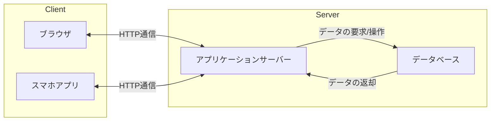

## はじめに

Webって何？と聞かれても年内の講義では語りつくせないほど幅広く曖昧なものです。Webは知らないといけない知識がとても多く、挫折しやすい分野でもあるため、講義内でも各自で開発する際にも分からないことがあったら、ぜひWeb研講師の@batora9、@yukikamome316、@sor4chi、@a01sa01toに聞いてみてください。いつでも歓迎します！

## Web研の目的・ねらい

Web研は年間を通して主にフロントエンド・バックエンド・デザインの講義を行います。Webについて初心者の方も、経験者の方も講義である程度の基礎的な知識や技術を身に着けることができると思います。
Webにおいては「作って学ぶ」ということが大切です。Webは少なくとも3言語（マークアップ含む）を扱う分野で、いちいち文法から始めるとその量に圧倒され簡単に挫折してしまいます。
そのため、「人のコードをコピペ（真似）して動かす」や「動いたらそれを拡張してみる」というように、うまく一回に学ぶ量を減らしつつ必要になったら調べる形で進めると良いです。
Web研では講習会を通してサンプルアプリケーション作りを学び、そのアプリケーションをベースとして拡張する形で学ぶと動かしながら、遊びながら勉強できて本当に楽です！

また、Webを学習するにあたってわからないことがあったら、まずは自分で調べてみましょう。自分で調べることで、なにがわからないのか自分で把握することができたり、調べようと思ったこと以上に知識を得ることができたり、調べる力がつくのではないかと思います。

## Webの分野

Webの分野には下の表にあるように様々な分野があります。年間のWeb研の講義を受けてみて自分の興味のある分野だったり、気になる分野があったら自分から進んで学んでみてはいかがでしょうか。
| 分野 | やること | 楽しさ | 関連ある分野 |
| --- | --- | --- | --- |
| フロントエンド | UI/UXの実装、高速化 | ユーザーとの距離が近い | バックエンド、デザイン、インフラ（最近） |
| バックエンド | サーバーサイドの実装、データベースの設計、高速化 | データベースの設計など、競プロと関連が深い | フロントエンド、インフラ |
| インフラ | サーバーの構築、運用、監視、高速化 | サーバーの構築や運用など、システム全体の設計 | フロントエンド（最近）、バックエンド |
| デザイン | サイトのUI/UX、Flow、デザインシステム | UIだけじゃなくFlowやデザインシステムなど奥が深い | フロントエンド |
| プロダクトマネジメント | 進捗管理、用件定義、チームのマネジメント | ビジネスに一番近いIT分野、MTG駆動 | フロントエンド、バックエンド |

## 通信の仕組み

Webの技術のベースとなるのはやはり「通信」です。通信とは、リクエストという「データをください！」という要求操作とレスポンスという「ほらやるよ！」という応答操作でやり取りが行われます。
やりとりにはプロトコルという通信のための約束事（規格）が必要で、Webでは主にHTTPというプロトコルを使います。HTTPは、後述のクライアントとサーバーの間で情報をやりとりするためのプロトコルです。
（ここでWebブラウザとサーバーを通信する仕組みと表現していないのは、スマホアプリなどWebブラウザを使わないWebアプリケーションもあるためです。）

### クライアントとサーバー

Webアプリケーションを作る上で、クライアントとサーバーに分けて考えることが多いです。
クライアントとはユーザーが直接触る部分のことで厳密には、HTTP リクエストを送る側 (具体例として Web ブラウザやスマホアプリ)などを指します。
一方サーバーとは、クライアントからのリクエストを受けて、レスポンスを返す部分のことで、Webサーバーやアプリケーションサーバーなどを指します。
図で説明するとこんな感じです



説明のために抽象化しているので、実際にはもっと構成が複雑ですが、このイメージがあれば大丈夫です。
今回はクライアントのうち、フロントエンドと呼ばれるWebブラウザを使った部分を扱います。

### Webブラウザ

ブラウザとは、Web上の情報を表示するためのソフトウェアです。
アプリケーションサーバーからのレスポンスを受け取り、HTMLやCSS、JavaScriptを解釈して画面に表示します。

### HTML

HTMLとは、Webページの骨組みを作るためのフォーマット記述言語です。（実はプログラミング言語ではありません）
実際にChromeだと検証から、他のブラウザでもDeveloper Toolsから実際に今表示されているサイトのHTMLを見ることができます。
（この行為を「検証する」や「インスペクトする」と言います）

## 実際にコードを書いてみよう

### HTML

まず作業ディレクトリを作成しましょう。作業ディレクトリ内で`index.html`を作成し、Visual Studio Codeなどのエディター(メモ帳でも可)で以下のコードを書いてみましょう。

```html
<!DOCTYPE html>
<html>
  <head>
    <title>タイトル</title>
  </head>
  <body>
    <h1>これは見出しです</h1>
    <p>これは段落です</p>
  </body>
</html>
```

#### HTMLの構造

ここでHTMLで使うタグについて説明します。上のコードで`<head>`や`<body>`や`<h1>`などをタグと呼び、基本的に`<タグ名>内容</タグ名>`と書きます。また、このまとまりをノードと呼びます。


また、HTMLは入れ子にすることができます。

入れ子にした時、そのタグを囲むタグを親要素、そのタグに囲まれたタグを子要素と呼びます。

#### タグの種類

よく使うタグを以下にまとめてみました。
|タグ名|説明|
|---|---|
|`<html>`|HTMLのルート（一番親の）要素。必ず一番外側に書く。|
|`<head>`|ページの情報を書く。タイトルやCSSの読み込みなど、実際に画面上には表示されないものを書く。|
|`<body>`|ページの本文を書く。実際に画面上に表示されるものを書く。|
|`<h1>` ~ `<h6>`|見出しを書く。数字が大きいほど小さな見出しになる。|
|`<p>`|段落を書く。|
|`<ul>`|順序なしリストを作る。|
|`<ol>`|順序ありリストを作る。|
|`<li>`|リストの項目を作る。|
|`<a>`|リンクを書く。`href`属性にリンク先のURLを書く。|
|``|画像を表示する。`src`属性に画像のURLを書く。|
|`<div>`|ブロック要素を作る。何かを囲んだり、レイアウトを整えたりするのに使う。|
|`<span>`|インライン要素を作る。何か（文字列など）を強調したり、レイアウトを整えたりするのに使う。|
|`<input>`|入力フォームを作る。`type`属性に入力フォームの種類を書く。|

では、`index.html`の中身を下のように書き換えてみましょう。

```html
<!DOCTYPE html>
<html>
  <head>
    <title>Web研講義1</title>
  </head>
  <body>
    
    <h1>Web研究会</h1>
    <h2>活動内容</h2>
    <p>Web研究会は、Webに興味のある学生が集まって、Web技術の研究や開発を行う<span>プログラミングサークルMaximumの活動の一環</span>です。</p>
    <h2>Webの分野</h2>
    <ul>
      <li>フロントエンド</li>
      <li>バックエンド</li>
      <li>インフラ</li>
    </ul>
    <a href="https://maximum.vc">Maximumのサイトはこちら</a>
  </body>
</html>
```

これを開くと、

少しWebサイトらしくなってきましたね

#### 絶対パスと相対パス

``タグの`src`属性には画像のURLを書きます。URLには絶対パスと相対パスがあります。絶対パスは`https://maximum.vc/images/hero.png`のように、画像のURLを完全に書く方法です。相対パスは`images/hero.png`のように、`index.html`から画像までのパスを書く方法です。
情報工学科の生徒は情報基礎の授業で習いますし、今後のWeb研の講義でもよく使うので覚えておいてください。

### CSS

CSSはHTMLの見た目を変えるための言語です。CSSはHTMLのタグにスタイルを適用することができます。CSSはHTMLとは別のファイルに書くことができますが、今回はHTML内に`<style>`タグを使って書いてみましょう。

### CSSの書き方

CSSは、`セレクタ { プロパティ: 値; }`という形で書きます。
`セレクタ`では、どの要素に対してCSSを適用するかを指定します。適用したい要素のタグ名、`class`や`id`などを指定することができます。
`プロパティ`は、どのようなプロパティを変更するかを指定します。よく使うプロパティはこちらになります。
| プロパティ | 説明 |
| --- | --- |
| `color` | 文字の色を変更します。 |
| `background-color` | 背景色を変更します。 |
| `font-size` | 文字の大きさを変更します。 |
| `width` | 要素の横幅を変更します。 |
| `height` | 要素の縦幅を変更します。 |
| `margin` | 要素の外側の余白を変更します。 |
| `padding` | 要素の内側の余白を変更します。 |
| `border` | 要素の境界線を変更します。 |

`値`は、プロパティに対してどのような値を指定するかを指定します。

では`index.html`の中身を下のように書き換えてみましょう。

```html
<!DOCTYPE html>
<html>
  <head>
    <title>Web研講義1</title>
    <style>
      h1 { 
        color: blue; 
      }
      span {
        color: red;
      }
      .hero {
        width: 700px;
      }
    </style>
  </head>
  <body>
    
    <h1>Web研究会</h1>
    <h2>活動内容</h2>
    <p>Web研究会は、Webに興味のある学生が集まって、Web技術の研究や開発を行う<span>プログラミングサークルMaximumの活動の一環</span>です。</p>
    <h2>Webの分野</h2>
    <ul>
      <li>フロントエンド</li>
      <li>バックエンド</li>
      <li>インフラ</li>
    </ul>
    <a href="https://maximum.vc">Maximumのサイトはこちら</a>
  </body>
</html>
```

これを開くと、

文字に色がついたり、画像の大きさが変わったりしましたね。

## まとめ

今回はWebの基礎を学び、HTMLとCSSを使ってWebページを作ってみました。次回はCSSの拡張とJavaScriptを使ってWebページを動かしてみましょう。
