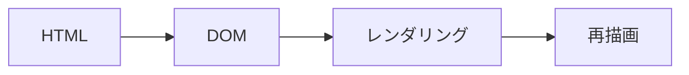

## Reactとは

Reactは、2013年にMeta(旧Facebook)によって開発・公開されたJavaScriptライブラリです。

Reactでは、UI(ユーザーインタフェース)をコンポーネントと呼ばれる部品を組み合わせて構築することができます。

## プロジェクトの作成

Reactのプロジェクトを作成してみましょう。

以下のコマンドを実行して、Reactのプロジェクトを作成します。

事前にnpmをインストールしておく必要があります

```bash
npx create-vite first-react-app
```

以下のような画面が表示されるので、`React`を選択します。


次に、`JavaScript`を選択します。


これで、`first-react-app`という名前のReactのプロジェクトが作成されました。

パッケージをインストールするため、以下のコマンドを実行します。

```bash
cd first-react-app
npm install
```

以下のコマンドを実行して、ローカルでサーバーを起動します。

```bash
npm run dev
```

これで、Reactのプロジェクトが起動し、ブラウザで確認することができます。

## JSX形式に慣れよう

JSXとは、JavaScriptの拡張構文です。

JSXは、JavaScriptではないため`.js`ファイルに書いてブラウザに読ませようとすると基本的には動きません。なのでViteやWebpack、TSCといった「トランスパイラ」を使って変換されたコードがブラウザ上でJavaScriptとして動作します。

まずは、以下のコードを見てみましょう。

```jsx
function App() {
  return (
    <div>
      <h1>Hello, World!</h1>
    </div>
  );
}
```

一見するとHTMLのように見えますが、実際にはJavaScriptの中で使われる特別なマークアップ言語です。

```jsx
function App() {
  const name = "batora9";
  return (
    <div>
      <h1>Hello, I&apos;m {name}</h1>
    </div>
  );
}
```

上記のように、JavaScriptの中で変数を使うことができます。

簡単に説明すると、`return`の中にHTMLのような記述を書くことができるみたいに思ってもらえれば大丈夫です。

## コンポーネントとは

Reactでは、UIをコンポーネントと呼ばれる単位に分割することができ、機能の分割や共通化をすることができます。

UIをコンポーネントに分割するとはどういうことでしょうか？


### コンポーネントを分割してみよう

`App.css`と`index.css`のコードをいったん削除し、`App.jsx`を以下のように書き換えます。

```jsx:App.jsx
function Header() {
  return (
    <header>
      <h1>買い物リスト</h1>
    </header>
  )
}

function TodoList() {
  return (
    <ul>
      <li>パンを買う</li>
      <li>牛乳を買う</li>
      <li>バターを買う</li>
    </ul>
  )
}

function App() {
  return (
    <>
      <div>
        <Header />
        <TodoList />
        <p>残金は 2800 円です</p>
      </div>
    </>
  )
}

export default App
```

`Header`と`TodoList`というコンポーネントを作成しました。これで、`App`コンポーネントが見やすくなりました。

コンポーネントは別のファイルに分割し、`import`することもできます。これは後のコードで説明します。

## 仮想DOMとは

ここからちょっと技術的な話になりますが、Reactの特徴である仮想DOMについて説明します。

まず、仮想DOMの説明に入る前にDOMについて説明します。

### DOMとは

DOM(Document Object Model)とは、JavaScriptやCSSなどのプログラミング言語からHTMLなどのマークアップ言語にアクセスできるようにするためのAPIです。

ブラウザはサーバーから受け取ったHTMLをDOMに変換します。その時、HTMLの要素をノードとして扱い、ツリー構造にして管理します。


例えばボタンの文字を変えたり、色を変えたりするように要素の追加や変更を行うことを**DOM操作**といいます。

```js
document.getElementById('hoge').textContent = 'Hello, World!'
```

DOM操作はレンダリングと大きく関係しており、上記のようにたった1行の要素の変更を行うだけでもブラウザの再描画が発生します。



### 仮想DOMとは

DOMの更新は、行われるたびにDOMの変更検知イベントが発生したり、CSSの再計算、描画処理など様々な計算が必要になるためコストが高いです。そのため、複雑なDOM操作を行ったり、要素を頻繁に更新したりすると、レンダリングに時間がかかってしまうことがあります。

その問題を解決するために、「仮想DOM」というものが生まれました。

仮想DOM(virtual DOM)は、メモリ上にDOMを再現したデータ構造を用意したものです。

コンポーネントの状態が更新され再レンダリングが要求された際に、更新前と更新後の差分を仮想DOMで検出し、1度のDOM更新で反映するという仕組みです。


## useState

Reactでは、コンポーネントの状態(動的に変わる要素や値)を管理するために`useState`というフックを提供しています。

:::details[フックとは]

フックとは、`useState`などのReactの機能を、クラスを書かずに関数コンポーネントの内部で使えるようになります。

`useState`以外にも、`useEffect`や`useContext`など、様々なフックが提供されています。

そうすることで、記述が簡潔になったり、コンポーネントの再利用性が高まったりします。

:::

```jsx
import { useState } from "react"
```

このように記述することで、`useState`を使うことができます。

`useState`は、コンポーネントの状態を管理するためのフックであり、初期値を引数に取り、現在の状態とその状態を更新するための関数を返します。

```jsx
const [count, setCount] = useState(0) // 初期値は0
const [value, setValue] = useState('') // 初期値は空文字
```

### 状態管理の例

それでは、`App.jsx`に`useState`を使ってみましょう。

```jsx:App.jsx
import { useState } from "react"

function App() {
  const [value, setValue] = useState('')
  return (
    <>
      <div>
        <h1>Hello React!</h1>
        <button onClick={() => setValue('ボタンが押されました')}>表示</button>
        <p>{value}</p>
      </div>
    </>
  )
}

export default App
```

サーバーを起動して、ブラウザで確認してみましょう。

ボタンを押すと、文字が表示されることが確認できます。

### カウンターを作ってみよう

次に、`useState`を使ってカウンターを作ってみましょう。

(例) ボタンを用意し+ボタンを押すとカウンターが1ずつ増える、-ボタンを押すとカウンターが1ずつ減る...

:::details[サンプルコード]

```jsx:App.jsx
import { useState } from "react"

function App() {
  const [count, setCount] = useState(0)

  return (
    <>
      <div>
        <h1>カウンター</h1>
        <p>{count}</p>
        <button onClick={() => setCount(count - 1)}>-</button>
        <button onClick={() => setCount(count + 1)}>+</button>
        <button onClick={() => setCount(0)}>リセット</button>
      </div>
    </>
  )
}

export default App
```

:::

## ReactRouter

ReactRouterは、Reactでシングルページアプリケーション(SPA)を作成するためのライブラリです。

ReactRouterを使うことで、ページ遷移を行うことができます。

### react-router-domのインストール

ReactRouterを使うためには、`react-router-dom`をインストールする必要があります。

```bash
npm install react-router-dom
```

### ルーティングの設定

`main.jsx`を以下のように書き換えます。

```jsx:main.jsx
import { createRoot } from "react-dom/client";
import { BrowserRouter, Routes, Route } from "react-router-dom";
import "./index.css";
import App from "./App.jsx";
import About from "./pages/About.jsx";

createRoot(document.getElementById("root")).render(
  <BrowserRouter>
    <Routes>
      <Route path="/" element={<App />} />
      <Route path="/about" element={<About />} />
    </Routes>
  </BrowserRouter>
);
```

`Route`コンポーネントを使って、URLに応じて表示するコンポーネントを指定します。

```jsx
<Route path="/about" element={<About />} />
```

上記のコードでは、`/about`にアクセスした際に`About`コンポーネントを表示するように設定しています。

### ページの作成

`src/pages`ディレクトリを作成し、`About.jsx`を作成します。

```jsx:About.jsx
import { Link } from "react-router-dom";

export default function About() {
  return (
    <div>
      <h1>About us</h1>
      <Link to="/">Homeに戻る</Link>
      <p>Maximumは埼玉大学で活動しているサークルです。</p>
    </div>
  );
}

```

次に、`App.jsx`を以下のように書き換えます。

```jsx:App.jsx
import { Link } from "react-router-dom";

function App() {
  return (
    <div>
      <h1>Maximum</h1>
      <Link to="/about">About</Link>
      <div>
        今後の予定
        <ul>
          <li>12/10 入門講習会</li>
          <li>12/16 Web研</li>
          <li>12/23 忘年会</li>
        </ul>
        気になる方は是非参加してみてください！
      </div>
    </div>
  );
}

export default App;

```

実際にローカルでサーバーを起動し、ブラウザで確認してみましょう。

- `/about`にアクセスすると、`About`コンポーネントが表示
- `Homeに戻る`をクリックすると、`Home`コンポーネントが表示

これで、ReactRouterを使ったページ遷移ができるようになりました。

## まとめ

今回は、Reactの基本となるコンポーネント化、仮想DOM、useState、ReactRouterについて学びました。Reactは、FacebookやInstagram、Netflixなどなど、Google以外の大企業で使われているライブラリであり、フロントエンド開発において非常に重要な技術です。

次回は、Reactを使ってTODOアプリを作成していく予定です。お楽しみに！
