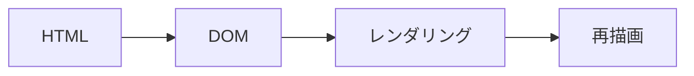

## Reactとは

Reactは、2013年にMeta(旧Facebook)によって開発・公開されたJavaScriptライブラリです。

Reactでは、UI(ユーザーインターフェース)をコンポーネントと呼ばれる部品を組み合わせて構築することができます。

## プロジェクトの作成

Reactのプロジェクトを作成してみましょう。

以下のコマンドを実行して、Reactのプロジェクトを作成します。

> 事前にnpmをインストールしておく必要があります

```bash
npx create-vite first-react-app
```

以下のような画面が表示されるので、`React`を選択します。


次に、`JavaScript`を選択します。


これで、`first-react-app`という名前のReactのプロジェクトが作成されました。

プロジェクトをGitで管理するため、作成したディレクトリに移動して、以下のコマンドを実行します。

```bash
cd first-react-app
git init
```

パッケージをインストールするため、以下のコマンドを実行します。

```bash
npm install
```

以下のコマンドを実行して、ローカルでサーバーを起動します。

```bash
npm run dev
```

これで、Reactのプロジェクトが起動し、ブラウザで確認することができます。

## JSX形式に慣れよう

JSXとは、JavaScriptの拡張構文です。

まずは、以下のコードを見てみましょう。

```jsx
function App() {
  return (
    <div>
      <h1>Hello, World!</h1>
    </div>
  );
}
```

一見するとHTMLのように見えますが、実際にはJavaScriptの中で使われる特別なマークアップ言語です。

```jsx
function App() {
    const name = "batra9";
  return (
    <div>
      <h1>Hello, I'm {name}</h1>
    </div>
  );
}
```

上記のように、JavaScriptの中で変数を使うことができます。

簡単に説明すると、`return`の中にHTMLのような記述を書くことができるみたいに思ってもらえれば大丈夫です。

## コンポーネントとは

Reactでは、UIをコンポーネントと呼ばれる部品に分割して作成します。

UIをコンポーネントに分割するとはどういうことでしょうか？


### コンポーネントを分割してみよう

`App.css`と`index.css`のコードをいったん削除し、`App.js`を以下のように書き換えます。

```jsx
function Header() {
  return (
    <header>
      <h1>買い物リスト</h1>
    </header>
  )
}

function TodoList() {
  return (
    <ul>
      <li>パンを買う</li>
      <li>牛乳を買う</li>
      <li>バターを買う</li>
    </ul>
  )
}

function App() {
  return (
    <>
      <div>
        <Header />
        <TodoList />
        <p>残金は 2800 円です</p>
      </div>
    </>
  )
}

export default App
```

`Header`と`TodoList`というコンポーネントを作成しました。これで、`App`コンポーネントが見やすくなりました。

コンポーネントは別のファイルに分割し、`import`することもできます。これは後のコードで説明します。

## 仮想DOMとは

ここからちょっと技術的な話になりますが、Reactの特徴である仮想DOMについて説明します。

まず、仮想DOMの説明に入る前にDOMについて説明します。

### DOMとは

DOM(Document Object Model)とは、JavaScriptやCSSなどのプログラミング言語からHTMLなどのマークアップ言語にアクセスできるようにするためのAPIです。

ブラウザはサーバーから受け取ったHTMLをDOMに変換します。その時、HTMLの要素をノードとして扱い、ツリー構造にして管理します。


例えばボタンの文字を変えたり、色を変えたりするように要素の追加や変更を行うことを**DOM操作**といいます。

DOM操作はレンダリングと大きく関係しており、要素の変更を行うだけでもブラウザの再描画が発生します。



### 仮想DOMとは

複雑なDOM操作を行ったり、要素を頻繁に更新したりすると、レンダリングに時間がかかってしまうことがあります。

その問題を解決するために、「仮想DOM」というものが生まれました。

仮想DOM(virtual DOM)は、メモリー上にDOMのコピーを用意し、実際にコンポーネントの変更があった場合にそのコピーとの差分を検出し、実際のDOMに反映するという仕組みです。


仮想DOMは、差分がある部分だけを更新することでDOM操作を最小限に抑え、レンダリングにかかる時間を短くすることができます。
