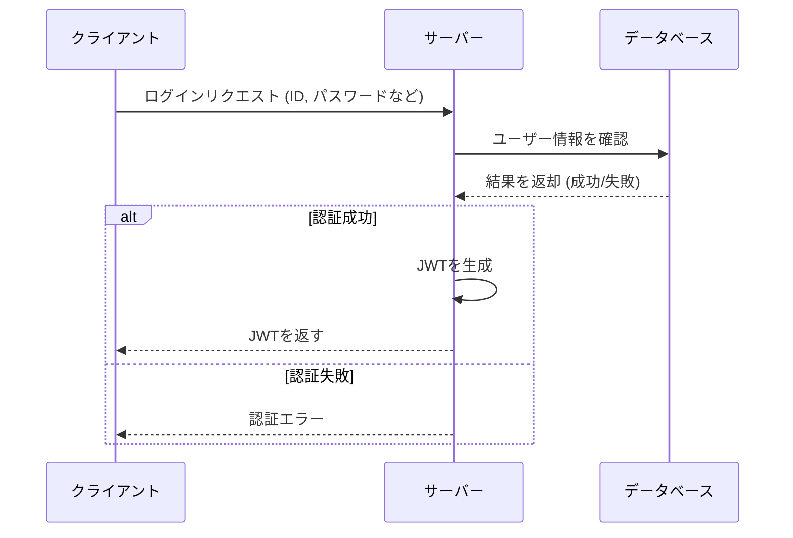
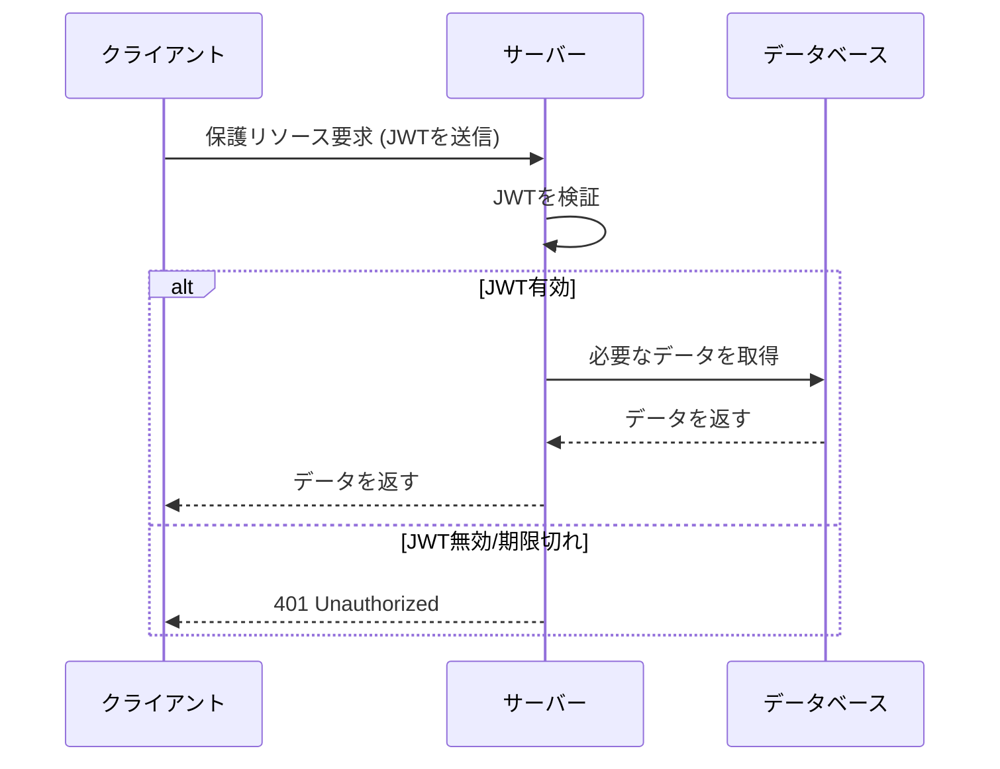

## 認証について

認証とは、何らかのシステムにアクセスする際に、そのユーザーが自分自身を証明するためのプロセスのことであり、簡単に言えばユーザーが誰であるかを確認することです。

Webに限った話ではなく、広義な意味での認証は大きく下の3つに分類されます。

- 知識情報 (例: パスワード認証)
- 所有情報 (例: SMS認証)
- 生体情報 (例: 指紋認証, 顔認証)

このように、何らかの情報を用いてユーザーを特定することを「認証」と呼びます。ユーザーを特定することを目的としており、それ以外の目的は認証に含まれません。

## 認可について

認証と似た単語に「認可」というものがあります。

認可とは、ユーザーが特定のリソースにアクセスする権限を持っているかどうかを確認することです。例えば、映画館のチケットを持っていると「対象の上映作品、特定の座席」というリソース(対象物)に対して、利用することができるという権限(認可)を与えられたということになります。

## JWT(JSON Web Token)とは

JWTはトークンベースの認証であり、リクエストを送信する際にヘッダーにトークンを含めることで認証を行います。

例えば、ユーザーがあるサービスにログインをした時にそのログインしたユーザーしかアクセスできないページを作りたいとしましょう。

ログインしたユーザーのみがアクセスできる、`/mypage`というページにアクセスするためには、トークンをリクエスト毎に送信し、そのトークンが有効かどうかを検証することでアクセスを許可するかどうかを判断します。

### JWTの仕組み

JWTの仕組みについて詳しく説明をします。JWTはその名の通りJSON形式でデータを扱います。JWTの使う利点には次のようなメリットがあります。

- ブラウザ側でトークンを保持するため実装が容易
- トークンの有効期限を設定できる
- トークンの署名を用いて改ざんを防ぐことができる
- シングルサインオン(SSO)に対応できる

#### トークンとは

トークンは暗号化された文字列であり、許可証のような役割を持ちます。JWTは、ヘッダー、ペイロード、シグネチャの3つの部分から構成されています。


ヘッダー部分には使用する暗号化方式が記述され、`HS256`がそれにあたります。ペイロード部分には、ユーザー情報やトークンの有効期限などの情報が記述されます。シグネチャ(署名)部分には、サーバー側に保持されてる秘密鍵を使い、`base64UrlEncode`という形でヘッダーとペイロードを暗号化するという情報が記述されます。


#### トークンの生成と検証

トークンはユーザー新規登録時やログイン時に生成されます。生成されたトークンには、ユーザー情報やトークンの有効期限などの情報が含まれ、ブラウザのローカルストレージやcookieに保存されます。



保護されたリソース(先ほどの`/mypage`や管理者画面など)にアクセスする際は保持しているトークンをリクエストヘッダーに含めて送信します。サーバー側では、受け取ったトークンを検証し、有効であればリソースにアクセスを許可します。



### JWTの実装方法

今回は、sor4chiさんが作成したGo言語でJWT認証を実装するためのテンプレートを基にJWT認証を実装方法を説明します。

<https://github.com/saitamau-maximum/go-react-auth-template>

#### ライブラリの説明

主にJWTを実装する際に使用するライブラリは以下の通りです。

- `github.com/dgrijalva/jwt-go` : JWTを扱うためのライブラリ
- `golang.org/x/crypto/bcrypt` : パスワードのハッシュ化を行うためのライブラリ

`login`ハンドラーをもとに説明します。クライアントから送られてきたリクエストボディからユーザーとパスワードを取得します。データベースに接続しユーザー情報からパスワードを取得します。

ユーザー作成時にパスワードはハッシュ化して格納されているため、リクエストから送られてきた平文のパスワードをハッシュ化し、データベースに格納されているハッシュ化されたパスワードと照合します。

```go
// リクエストボディの読み込み
var user User
if err := decodeBody(r, &user); err != nil {
    respondJSON(w, http.StatusBadRequest, map[string]string{"message": "不正なリクエストです"})
    return
}

// ユーザーの取得
row := db.QueryRow(selectUserByEmail, user.Email)
var u User
err := row.Scan(&u.ID, &u.Name, &u.Email, &u.Password, &u.CreatedAt)
if err != nil {
    respondJSON(w, http.StatusBadRequest, map[string]string{"message": "メールアドレスまたはパスワードが間違っています"})
    return
}

// パスワードの照合
if err := bcrypt.CompareHashAndPassword([]byte(u.Password), []byte(user.Password)); err != nil {
    respondJSON(w, http.StatusBadRequest, map[string]string{"message": "メールアドレスまたはパスワードが間違っています"})
    return
}
```

ユーザー情報が正しい場合、JWTを生成します。JWTのペイロード部分にユーザーIDとトークンの有効期限を設定します。

```go
// JWTの作成
claims := jwt.MapClaims{
    "user_id": u.ID,
    "exp":     time.Now().Add(time.Hour * 72).Unix(), // 72時間が有効期限
}
```

JWTを署名するために、サーバー側で設定している秘密鍵を用いて署名を行います。

```go
// 署名を設定する
tokenString, err := token.SignedString(secret)
```

クライアントにJWTを返却します。

```go
// トークンをレスポンスする
respondJSON(w, http.StatusOK, map[string]interface{}{
    "token": tokenString,
    "user":  u,
})
```

## OAuthとは
