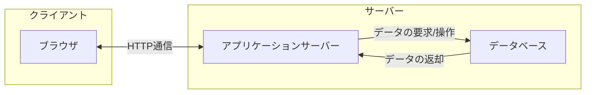

## はじめに

今回からNode.jsを使うため[Node.jsの導入](../5#nodejsのインストール)が必要です。インストールがまだの方は先に進む前にインストールを行ってください。

また、今回のWeb研からGitを用いてコードを管理します。Git(GitHub)の講習会に参加していない方は、[【第4回】Git(GitHub)入門](../4)を参照してください。

## Webサーバーとは

Webサーバーとは、インターネット上でWebページを提供するためのシステムのことです。

例えば、Webブラウザ(Chrome, Firefox, Safari, Edgeなど)を使ってwww.example.comというサイトを見ようとする時に、何が起きているでしょうか？

ブラウザがwww.example.comにアクセスすると、www.example.comのサーバーにリクエストが送られます。そして、サーバーがリクエストを受け取り、HTMLファイルやその他(画像、CSS、JavaScriptなど)のファイルが返されて、データが表示されます。



## HTTPサーバーを書いてみよう

まず、`http-server-intro`という作業ディレクトリを作りましょう。

作業ディレクトリ内で、Gitリポジトリを初期化しましょう。

```bash
git init
```

`package.json`というファイルを作成し、以下のように記述して下さい。

```json:package.json
{
  "name": "http-server-intro",
  "type": "module",
}
```

`server.js`というファイルを作成し、以下のコードを書いてください。

```js:server.js
import http from "http";

const server = http.createServer((req, res) => {
  res.writeHead(200, { "Content-Type": "text/plain" });
  res.end("Hello, Node.js!");
});

server.listen(3000);
```

サーバーを起動してみましょう。

```bash
node server.js
```

`http://localhost:3000`にアクセスすると、`Hello, Node.js!`と表示されます。

これで、Web(HTTP)サーバーが作成できました。

タスクをキルするには、`Ctrl + C`(Windows)または`Command + C`(Mac)を押してください。

作成したファイルをGitリポジトリに追加し、コミットしましょう。

```bash
git add .
git commit -m "Webサーバーを作成し、Hello, Node.js!と表示する"
```

`git add .`を実行することで、全てのファイルを追跡対象としています。
追跡対象のファイルに変更があるため、 `git commit` でその変更履歴を記録しています。

### 解説

```js
import http from "http";
```

`http`モジュールをインポートしています。`http`モジュールはNode.jsに標準で組み込まれているモジュールで、HTTPサーバーを作成するための機能を提供しています。

このモジュールを使わないと、プロトコル(通信の約束事)の実装やソケット通信(通信用インターフェース)の実装など、低レイヤーから入らなければならず、とてもめんどくさいです。そのため`http`モジュールや`express`などのモジュールを使うことが一般的です。

```js
const server = http.createServer((req, res) => {
  res.writeHead(200, { "Content-Type": "text/plain" });
  res.end("Hello, Node.js!");
});
```

`http.createServer`メソッドは、HTTPサーバーを作成するメソッドです。引数にはリクエストを処理するコールバック関数を指定します。コールバック関数の引数には、**リクエスト情報が格納されたオブジェクト,レスポンスに使うオブジェクト**が渡されます。

`res.writeHead`メソッドは、レスポンスヘッダを書き込むメソッドです。引数にはステータスコードとヘッダ情報を指定します。ステータスコード`200`は「OK」を表し、`Content-Type`ヘッダには`text/plain`を指定しています。

:::details[ステータスコードとは]

HTTPレスポンスステータスコードとは、特定のHTTPリクエストが正常に処理されたかどうかを示します。

主なステータスコードは以下の通りです。

| ステータスコード | 意味 |
| --- | --- |
| `100`-`199` | 情報レスポンス |
| `200`-`299` | 成功レスポンス |
| `300`-`399` | リダイレクト |
| `400`-`499` | クライアントエラー |
| `500`-`599` | サーバーエラー |

皆さんも見かけたことがあるかもしれないステータスコードを挙げてみます。

- `404 Not Found`：リクエストされたリソースが見つからないことを示します。(URLが間違っていたり、リダイレクトの設定ミスなど)
- `403 Forbidden`：リクエストされたリソースに**アクセス権限がない**ことを示します。
- `500 Internal Server Error`：サーバー内部でエラーが発生したことを示します。
- `502 Bad Gateway`：サーバーの通信状態に問題があることを示します。
- `200 OK`：リクエストが成功したことを示します。

:::

```js
server.listen(3000);
```

`server.listen`メソッドは、HTTPサーバーが指定したポートでリクエストを待ち受けるメソッドです。引数にはポート番号を指定します。

### package.jsonとは何か

`package.json`は、使用したライブラリやそのバージョン、ライブラリの依存関係などの情報が詰まった、Node.jsプロジェクトの設定ファイルです。

簡単に言うと「アプリ開発の際に自分がインストールして使ったライブラリやそのバージョンを記録しておくファイル」です。

以下のコマンドを実行するか、自分で作成することができます。

```bash
npm init
```

このファイルは、複数人で共同開発をするときなどに、使用しているライブラリやそのバージョンなどをそろえた環境で開発を行うことが望ましいためです。

ライブラリのバージョンが異なると、コードの書き方が変わっていたり、正常に動作しないことがあったりするためです。

## サーバーにリクエストを送信してみよう

> リクエストとは、クライアント(ブラウザ)がサーバーに送信する要求のことです。

### リクエストの種類

HTTPリクエストには、主に以下のような種類があります。

| メソッド | 説明 | 例 |
| --- | --- | --- |
| GET | リソースの取得 | ブラウザでWebページを表示するとき |
| POST | リソースの作成 | フォームからデータを送信するとき |
| PUT | リソースの更新 | ファイルなどを送信内容で上書き更新するとき |
| DELETE | リソースの削除 | ファイルなどを削除するとき |

リクエストを送信する方法には、ブラウザを使う方法以外にも、`curl`コマンドや`Postman`などのツールを使う方法があります。

### curlコマンドを使ってリクエストを送信してみよう

先ほどの`server.js`を以下のように変更してください。

```js:server.js
import http from "http";

const server = http.createServer((req, res) => {
  // レスポンスのヘッダーを作成、今回はいつでもただのテキストを返したいので先に作っておく
  const headers = {
    "Content-Type": "text/plain",
  };
  // リクエストのメソッドによって処理を分岐
  if (req.method === "GET") {
    res.writeHead(200, headers);
    res.end("Hello, World!\n");
  } else if (req.method === "POST") {
    res.writeHead(200, headers);
    res.end("Received POST request\n");
  } else {
    res.writeHead(404, headers);
    res.end("404 Not Found\n");
  }
});

// サーバーを起動
server.listen(8000, () => {
  console.log("Server running on port 8000");
});
```

サーバーを起動してみましょう。

```bash
# &を付けてバックグラウンドで実行
node server.js &
```

`curl`コマンドを使ってリクエストを送信してみましょう。

```bash
# GETリクエスト
curl http://localhost:8000
```

`Hello, World!`と表示されます。

```bash
# POSTリクエスト
curl -X POST http://localhost:8000
```

`Received POST request`と表示されます。

```bash
# DELETEリクエスト
curl -X DELETE http://localhost:8000
```

DELETEリクエストは条件に合致しないため、`404 Not Found`と表示されます。

タスクをキルして終了させましょう。

```bash
# バックグラウンドで実行しているタスクをフォアグラウンドに戻す
fg
```

`Ctrl + C`(Windows)または`Command + C`(Mac)を押してください。

それでは、編集したファイルをコミットしましょう。

```bash
git add .
git commit -m "GETとPOSTリクエストを受け取るサーバーを作成"
```

### 解説

```js
if (req.method === "GET")
```

`req.method`はリクエストのメソッドを表し、`GET`メソッドでリクエストが送信されたときに実行されます。

## ルーティングを実装してみよう

> ルーティングとは、リクエストされたURLに応じて処理を振り分けることです。

`server.js`を以下のように変更してください。

```js:server.js
import http from "http";

// ユーザーのリストを定義
const userList = [
  { id: 1, name: "Alice", county: "USA", age: 19 },
  { id: 2, name: "Bob", county: "Canada", age: 25 },
  { id: 3, name: "Ken", county: "Japan", age: 22 },
];

const server = http.createServer((req, res) => {
  if (req.url === "/" && req.method === "GET") {
    res.writeHead(200, { "Content-Type": "text/plain" });
    res.end("Hello, World!\nAccess to /users to get user data!");
  }
  if (req.url === "/users" && req.method === "GET") {
    res.writeHead(200, { "Content-Type": "application/json" });
    res.end(JSON.stringify(userList));
  }
});

server.listen(8000, () => {
  console.log("Server is running on port 8000");
});
```

サーバーを起動してみましょう。

```bash
node server.js
```

ブラウザなどで`http://localhost:8000`にアクセスすると、`/`(ルート)というURLにアクセスした場合のメッセージが表示されます。

次に、`http://localhost:8000/users`にアクセスしてみましょう。

`/users`というURLにアクセスした場合、`userList`という**JSON形式のデータ**が応答(レスポンス)として返され、表示されます。

それでは、編集したファイルをコミットしましょう。

```bash
git add .
git commit -m "ルーティングを実装し、ユーザーリストをJSON形式で返す"
```

### 解説

```js
if (req.url === "/" && req.method === "GET")
```

`req.url`はリクエストされたURLを表します。リクエストのメゾットが`GET`で、`/`にアクセスしたときに実行されます。

```js
if (req.url === "/users" && req.method === "GET")
```

同様に`/users`にアクセスしたときに実行されます。

```js
res.writeHead(200, { "Content-Type": "application/json" });
res.end(JSON.stringify(userList));
```

`application/json`とは、レスポンスにおいてJSON形式のデータを返すことを示します。

## JSON形式のデータを扱ってみよう

ここで、JSON形式のデータって何?となるかもしれません。

JSON(JavaScript Object Notation)は、JavaScriptにおけるオブジェクトの書き方を参考に作られたデータフォーマット(データの記述形式)です。

世界中の様々なサイトはJSONを使った通信が使われており、現状一番ベーシックなデータ通信の方法だと言えると思います。

(詳しくは[API Technologies - The State of API Technologies in 2021 | Postman](https://www.postman.com/state-of-api/api-technologies/#api-technologies)を参照)

JSONは軽量かつ可読性が高く、APIを用いてWebサイトからデータを取得する際によく使われます。ちなみに、序盤に作成された`package.json`もJSON形式で記述されています。

先ほど返された`userList`は以下のようなJSON形式のデータです。

```json
[
  {
    "id": 1,
    "name": "Alice",
    "county": "USA",
    "age": 19
  },
  {
    "id": 2,
    "name": "Bob",
    "county": "Canada",
    "age": 25
  },
  {
    "id": 3,
    "name": "Ken",
    "county": "Japan",
    "age": 22
  }
]
```

### 他のデータフォーマットとの違い

- CSV(Comma-Separated Values)：カンマで区切られたテキストデータ

```text
id,name,county,age
1,Alice,USA,19
2,Bob,Canada,25
3,Ken,Japan,22
```

- XML(eXtensible Markup Language)：HTMLと同じようにデータをタグで囲む形式
  
```xml
<users>
  <user>
    <id>1</id>
    <name>Alice</name>
    <county>USA</county>
    <age>19</age>
  </user>
  <user>
    <id>2</id>
    <name>Bob</name>
    <county>Canada</county>
    <age>25</age>
  </user>
  <user>
    <id>3</id>
    <name>Ken</name>
    <county>Japan</county>
    <age>22</age>
  </user>
</users>
```

## TODOアプリを作ってみよう

新しく`simple-todo-app`という作業ディレクトリを作りましょう。

Gitリポジトリを初期化しましょう。

```bash
git init
```

`package.json`というファイルを作成し、以下のように記述してください。

```json:package.json {3}
{
  "name": "simple-todo-app",
  "type": "module",
}
```

`server.js`というファイルを作成し、以下のコードを書いてください。

```js:server.js
import http from "http";
import { StringDecoder } from "string_decoder"; // 文字列をデコードするためのモジュール

// TODOリストを定義
const todoList = [
  { title: "JavaScriptを勉強する", completed: false },
  { title: "TODOアプリを自作する", completed: false },
  { title: "漫画を読み切る", completed: true },
  { title: "ゲームをクリアする", completed: false },
];

const server = http.createServer((req, res) => {
  const decoder = new StringDecoder("utf-8"); // 文字列をデコードするためのインスタンス
  let buffer = ""; // リクエストデータを空文字列で初期化

  req.on("data", (data) => {
    buffer += decoder.write(data);
  });

  req.on("end", () => {
    buffer += decoder.end();

    const headers = {
      "Content-Type": "application/json",
    };

    if (req.method === "GET" && req.url === "/") {
      res.writeHead(200, headers);
      res.end(JSON.stringify(todoList));
    } else if (req.method === "POST" && req.url === "/") {
      try {
        const data = JSON.parse(buffer);
        // タイトルが空の場合はエラーを返す
        if (!data.title) {
          throw new Error("Title must be provided");
        }

        // 新しいTODOのタイトルと完了状態を定義
        const newTodo = {
          title: data.title,
          completed: !!data.completed,
        };

        // 配列todoListに新しいTODOを追加(push)する
        todoList.push(newTodo);
        // 正常に処理されたことを返す
        res.writeHead(200, headers);
        res.end(JSON.stringify({ message: "Successfully created" }));
      } catch (err) {
        // 400 Bad Requestを返す
        res.writeHead(400, headers);
        // エラーメッセージを返す
        res.end(JSON.stringify({ message: err.message }));
      }
    } else {
      res.writeHead(404, headers);
      res.end(JSON.stringify({ message: "Not Found" }));
    }
  });
});

server.listen(8000, () => {
  console.log("Server running on port 8000");
});
```

次に、以下のコマンドを実行してください。

```bash
node server.js &
```

`http://localhost:8000`にアクセスすると、TODOリストが表示されます。

### 新しいTODOを追加してみよう

curlを使ってPOSTリクエストを送信してみましょう。

```bash
curl -X POST -H "Content-Type: application/json" -d '{"title": "次回のWeb研に出席する"}' http://localhost:8000
```

ページをリロードすると、新しいTODOが追加されていることが確認できます。

タスクをキルして終了させましょう。

```bash
# バックグラウンドで実行しているタスクをフォアグラウンドに戻す
fg
```

`Ctrl + C`(Windows)または`Command + C`(Mac)を押してください。

それでは、編集したファイルをコミットしましょう。

```bash
git add .
git commit -m "POSTリクエストを送ることでTODOを追加できるようにした"
```

### 解説

```js
import { StringDecoder } from "string_decoder";
```

`string_decoder`モジュールをインポートしています。`string_decoder`モジュールは、リクエスト内容が"UTF-8"という文字コードで送られてくることを期待し、送られてきたバイト列(Buffer)を変換するためのものです。

```js
req.on("data", (data) => {
  buffer += decoder.write(data);
});
```

クライアントからデータを受け取ったときに、`data`イベントが発生します。データを受け取り、`buffer`に追加しています。

```js
req.on("end", () => {
  buffer += decoder.end();
  // 以下略
});
```

データの受け取りが完了したときに、`end`イベントが発生します。データの受け取りが完了したら、`buffer`に追加していたデータを`decoder.end()`でデコード(文字列に変換)し、`buffer`に格納します。

```js
if (req.method === "GET" && req.url === "/") {
  res.writeHead(200, headers);
  res.end(JSON.stringify(todoList));
}
```

`GET`メソッドで`/`にアクセスしたときに、`todoList`をJSON形式で返します。

```js
todoList.push(newTodo);
```

`todoList`という配列に`push`で、末尾に新しいTODOを追加します。

```js
try {
  // 例外が発生する可能性のある処理
} catch (err) {
  // 例外が発生したときの処理
}
```

`try...catch`文は、例外が発生する可能性のある処理をブロックで囲み、例外が発生したときには別の処理を行うための文です。

:::details[例外処理の詳しい解説]

JSでは`throw`という命令でプログラムの実行を止めてスコープを遡ることができます。

基本は`throw`されると大域（一番上のスコープ）まで遡ってプログラムが終了しますが、遡るときに`try`文があれば、そこで遡るのをやめ、`catch`を実行するようになっています。

基本的にjsの関数はエラーを`throw new Error("エラーメッセージ")`として表現してくれているため、**エラーが起きるかも**という箇所を`try`ブロックで囲っておくことで例外処理ができるという仕組みです。

サンプルコード

```js
// 50%の確率でエラーを発生させる害悪関数
const greet = () => {
  if (Math.random() > 0.5) {
    throw new Error('もう昼だぞ！');
  } else {
    console.log('おはようございます');
  }
};

// エラーをキャッチしてないのでそのままプログラムが停止する
greet();

// エラーをキャッチしてプログラムを停止させないようにする
try {
  greet();
} catch (e) {
  console.log('エラーが発生したらしいぞ');
  console.error(e);
}
```

:::

## まとめ

今回はNode.jsを使ってWebサーバーを作成し、ルーティングについて学習したり、JSON形式のデータを扱ってみたりしました。これまでに紹介したJavaScriptの文法に加えて、今回は少し実践的なプログラムに触れたため、慣れない部分も多いと思います。そういった方は、基礎的な文法はマスターする必要はありますが、細かい部分まで完璧に覚える必要はありません。コピペで実装しても為になると思います。

次回は、 Node.js より簡潔にコードを書くことができる Hono というフレームワークを使って、TODOアプリを作る予定です。
