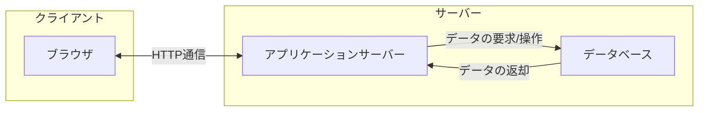

## はじめに

今回からNode.jsを使うため[Node.jsの導入](../5#nodejsのインストール)が必要です。インストールがまだの方は先に進む前にインストールを行ってください。

## Webサーバーとは

Webサーバーとは、インターネット上でWebページを提供するためのシステムのことです。

例えば、Webブラウザ(Google Chorme, Firefox, Safari, Edgeなど)を使ってwww.example.comというサイトを見ようする時に、何が起きているでしょうか？

ブラウザがwww.example.comにアクセスすると、www.example.comのサーバーにリクエストが送られます。すると、サーバーのデータべースからHTMLファイルやその他(画像、CSS、JavaScriptなど)のファイルを取得し、ブラウザに返します。ブラウザは受け取ったファイル



## HTTPサーバーを書いてみよう

まず、`node-http-server`という作業ディレクトリを作りましょう。

作業ディレクトリ内で以下のコマンドを実行してください。

```bash
npm init -y
```

`package.json`が作成されたら、以下のように追記してください。

```json:package.json {3}
{
  "name": "http-server",
  "type": "module",
  "version": "1.0.0",
  "main": "index.js",
  "scripts": {
    "test": "echo \"Error: no test specified\" && exit 1"
  },
  "keywords": [],
  "author": "",
  "license": "ISC",
  "description": ""
}
```

`server.js`というファイルを作成し、以下のコードを書いてください。

```js:server.js
import http from "http";

const server = http.createServer((req, res) => {
  res.writeHead(200, { "Content-Type": "text/plain" });
  res.end("Hello, Node.js!");
});

server.listen(3000);
```

次に、以下のコマンドを実行してください。

```bash
node server.js
```

`http://localhost:3000`にアクセスすると、`Hello, Node.js!`と表示されます。

これで、Web(HTTP)サーバーが作成できました。

### 解説

```js
import http from "http";
```

`http`モジュールをインポートしています。`http`モジュールはNode.jsに標準で組み込まれているモジュールで、HTTPサーバーを作成するための機能を提供しています。

```js
const server = http.createServer((req, res) => {
  res.writeHead(200, { "Content-Type": "text/plain" });
  res.end("Hello, Node.js!");
});
```

`http.createServer`メソッドは、HTTPサーバーを作成するメソッドです。引数にはリクエストを処理するコールバック関数を指定します。コールバック関数の引数には、リクエストオブジェクト`req`とレスポンスオブジェクト`res`が渡されます。

`res.writeHead`メソッドは、レスポンスヘッダを書き込むメソッドです。引数にはステータスコードとヘッダ情報を指定します。ステータスコード`200`は「OK」を表し、`Content-Type`ヘッダには`text/plain`を指定しています。

```js
server.listen(3000);
```

`server.listen`メソッドは、HTTPサーバーが指定したポートでリクエストを待ち受けるメソッドです。引数にはポート番号を指定します。

### package.jsonとは何か

## APIサーバーを作成してみよう

## TODOアプリを作ってみよう

## まとめ
