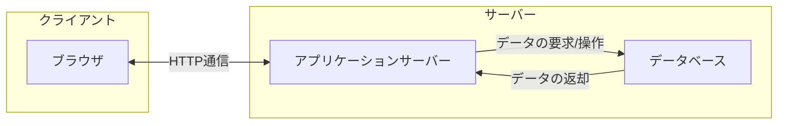

## はじめに

今回からNode.jsを使うため[Node.jsの導入](../5#nodejsのインストール)が必要です。インストールがまだの方は先に進む前にインストールを行ってください。

## Webサーバーとは

Webサーバーとは、インターネット上でWebページを提供するためのシステムのことです。

例えば、Webブラウザ(Google Chorme, Firefox, Safari, Edgeなど)を使ってwww.example.comというサイトを見ようする時に、何が起きているでしょうか？

ブラウザがwww.example.comにアクセスすると、www.example.comのサーバーにリクエストが送られます。すると、サーバーのデータべースからHTMLファイルやその他(画像、CSS、JavaScriptなど)のファイルを取得し、ブラウザに返します。ブラウザは受け取ったファイル



## HTTPサーバーを書いてみよう

まず、`node-http-server`という作業ディレクトリを作りましょう。

作業ディレクトリ内で以下のコマンドを実行してください。

```bash
npm init -y
```

`package.json`が作成されたら、以下のように追記してください。

```json:package.json {3}
{
  "name": "http-server",
  "type": "module",
  "version": "1.0.0",
  "main": "index.js",
  "scripts": {
    "test": "echo \"Error: no test specified\" && exit 1"
  },
  "keywords": [],
  "author": "",
  "license": "ISC",
  "description": ""
}
```

`server.js`というファイルを作成し、以下のコードを書いてください。

```js:server.js
import http from "http";

const server = http.createServer((req, res) => {
  res.writeHead(200, { "Content-Type": "text/plain" });
  res.end("Hello, Node.js!");
});

server.listen(3000);
```

次に、以下のコマンドを実行してください。

```bash
node server.js
```

`http://localhost:3000`にアクセスすると、`Hello, Node.js!`と表示されます。

これで、Web(HTTP)サーバーが作成できました。

### 解説

```js
import http from "http";
```

`http`モジュールをインポートしています。`http`モジュールはNode.jsに標準で組み込まれているモジュールで、HTTPサーバーを作成するための機能を提供しています。

```js
const server = http.createServer((req, res) => {
  res.writeHead(200, { "Content-Type": "text/plain" });
  res.end("Hello, Node.js!");
});
```

`http.createServer`メソッドは、HTTPサーバーを作成するメソッドです。引数にはリクエストを処理するコールバック関数を指定します。コールバック関数の引数には、リクエストオブジェクト`req`とレスポンスオブジェクト`res`が渡されます。

`res.writeHead`メソッドは、レスポンスヘッダを書き込むメソッドです。引数にはステータスコードとヘッダ情報を指定します。ステータスコード`200`は「OK」を表し、`Content-Type`ヘッダには`text/plain`を指定しています。

:::details[ステータスコードとは]
HTTPレスポンスステータスコードとは、特定のHTTPリクエストが正常に処理されたかどうかを示します。

主なステータスコードは以下の通りです。

| ステータスコード | 意味 |
| --- | --- |
| `100`-`199` | 情報レスポンス |
| `200`-`299` | 成功レスポンス |
| `300`-`399` | リダイレクト |
| `400`-`499` | クライアントエラー |
| `500`-`599` | サーバーエラー |

皆さんも見かけたことはあるかもしれないステータスコードを挙げてみました。

- `404 Not Found`：リクエストされたリソースが見つからないことを示します。(URLが間違っていたり、リダイレクトの設定ミスなど)
- `403 Forbidden`：リクエストされたリソースに**アクセス権限がない**ことを示します。
- `500 Internal Server Error`：サーバー内部でエラーが発生したことを示します。
- `502 Bad Gateway`：サーバーの通信状態に問題があることを示します。
- `200 OK`：リクエストが成功したことを示します。
:::

```js
server.listen(3000);
```

`server.listen`メソッドは、HTTPサーバーが指定したポートでリクエストを待ち受けるメソッドです。引数にはポート番号を指定します。

### package.jsonとは何か

`package.json`は、使用したライブラリやそのバージョン、ライブラリの依存関係などの情報が詰まった、Node.jsプロジェクトの設定ファイルです。

簡単に言うと「アプリ開発の際に自分がインストールして使ったライブラリやそのバージョンを記録しておくファイル」です。

以下のコマンドを実行するだけで作成できます。

```bash
npm init
```

このファイルは、複数人で共同開発をするときなどに、使用しているライブラリやそのバージョンなどが同じ環境で開発を行うことが望ましためです。

ライブラリのバージョンが異なると、コードの書き方が変わっていたり、正常に動作しないことがあるためです。

## サーバーにリクエストを送信してみよう

> リクエストとは、クライアント(ブラウザ)がサーバーに送信する要求のことです。

### リクエストの種類

HTTPリクエストには、主に以下のような種類があります。

| メソッド | 説明 | 例 |
| --- | --- | --- |
| GET | リソースの取得 | ブラウザでWebページを表示するとき |
| POST | リソースの作成 | フォームからデータを送信するとき |
| PUT | リソースの更新 | ファイルなどを送信内容で上書き更新するとき |
| DELETE | リソースの削除 | ファイルなどを削除するとき |

リクエストを送信する方法には、ブラウザを使う方法以外にも、`curl`コマンドや`Postman`などのツールを使う方法があります。

### curlコマンドを使ってリクエストを送信してみよう

先ほどの`server.js`を以下のように変更してください。

```js:server.js
import http from "http";

const server = http.createServer((req, res) => {
    // レスポンスのヘッダーを設定
    const headers = {
        "Content-Type": "text/plain",
    };
    // リクエストのメソッドによって処理を分岐
    if (req.method === "GET") {
        res.writeHead(200, headers);
        res.end("Hello, World!\n");
    } else 
    if (req.method === "POST") {
        res.writeHead(200, headers);
        res.end("Received POST request\n");
    } else {
        res.writeHead(404, headers);
        res.end("404 Not Found\n");
    }
});

server.listen(8000, () => {
    console.log("Server running on port 8000");
});
```

サーバーを起動してみましょう。

```bash
npm start &
```

`curl`コマンドを使ってリクエストを送信してみましょう。

```bash
# GETリクエスト
curl http://localhost:8000
```

`Hello, World!`と表示されます。

```bash
# POSTリクエスト
curl -X POST http://localhost:8000
```

`Received POST request`と表示されます。

```bash
# DELETEリクエスト
curl -X DELETE http://localhost:8000
```

DELETEリクエストは条件に合致しないため、`404 Not Found`と表示されます。

## TODOアプリを作ってみよう

新しく`simple-todo-app`という作業ディレクトリを作りましょう。

作業ディレクトリ内で以下のコマンドを実行してください。

```bash
npm init -y
```

`package.json`が作成されたら、以下のように追記してください。

```json:package.json {3}
{
  "name": "http-server",
  "type": "module",
  "version": "1.0.0",
  "main": "index.js",
  "scripts": {
    "test": "echo \"Error: no test specified\" && exit 1"
  },
  "keywords": [],
  "author": "",
  "license": "ISC",
  "description": ""
}
```

以下のコマンドを実行してください。

```bash
npm install
```

`server.js`というファイルを作成し、以下のコードを書いてください。

```js:server.js
import http from "http";
import { StringDecoder } from "string_decoder"; // 文字列をデコードするためのモジュール

const todoList = [
  { title: "JavaScriptを勉強する", completed: false },
  { title: "TODOアプリを自作する", completed: false },
  { title: "漫画を読み切る", completed: true },
  { title: "ゲームをクリアする", completed: false },
];

const server = http.createServer((req, res) => {
  const decoder = new StringDecoder("utf-8");
  let buffer = "";

  req.on("data", (data) => {
    buffer += decoder.write(data);
  });

  req.on("end", () => {
    buffer += decoder.end();

    const headers = {
      "Content-Type": "application/json",
    };

    if (req.method === "GET" && req.url === "/") {
      res.writeHead(200, headers);
      res.end(JSON.stringify(todoList));
    } else if (req.method === "POST" && req.url === "/") {
      try {
        const data = JSON.parse(buffer);
        if (!data.title) {
          throw new Error("Title must be provided");
        }

        const newTodo = {
          title: data.title,
          completed: !!data.completed,
        };

        todoList.push(newTodo);
        res.writeHead(200, headers);
        res.end(JSON.stringify({ message: "Successfully created" }));
      } catch (err) {
        res.writeHead(400, headers);
        res.end(JSON.stringify({ message: err.message }));
      }
    } else {
      res.writeHead(404, headers);
      res.end(JSON.stringify({ message: "Not Found" }));
    }
  });
});

server.listen(8000, () => {
  console.log("Server running on port 8000");
});
```

次に、以下のコマンドを実行してください。

```bash
node server.js &
```

`http://localhost:8000`にアクセスすると、TODOリストが表示されます。

### 新しいTODOを追加してみよう

curlを使ってPOSTリクエストを送信してみましょう。

```bash
curl -X POST -H "Content-Type: application/json" -d '{"title": "次回のWeb研に出席する"}' http://localhost:8000
```

ページをリロードすると、新しいTODOが追加されていることが確認できます。

## まとめ
