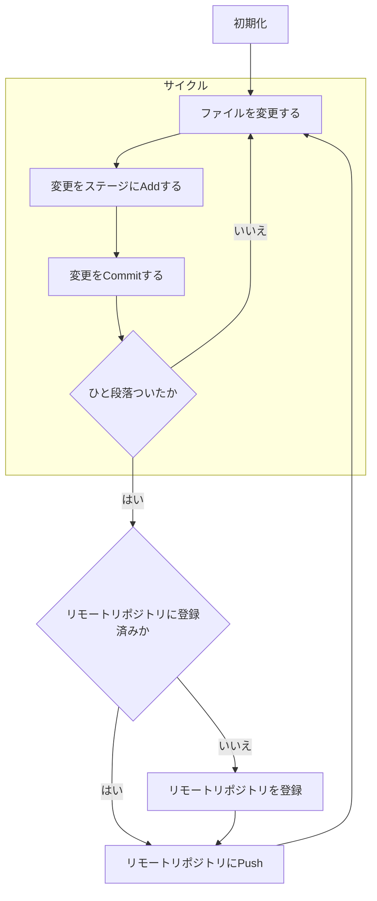
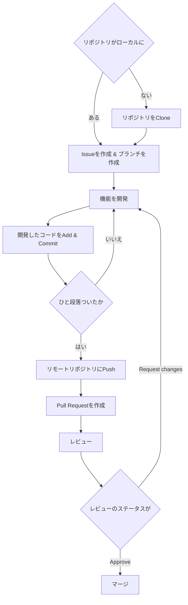

## おさらい

前回[【第3回】 Git/Githubを使ってコードを管理しよう](/blog/webken-3/)では、GitとGithubを実際に使ってみました。

### Gitの基本的な流れ

Gitを使う上での基本的な流れをおさらいしておきましょう。

Gitは**ローカル**でファイルの変更履歴を管理する仕組み・ツールです。

まずはローカルに**リポジトリ**を作成します。
リポジトリとは、Gitで管理するファイルやディレクトリのことを指します。
`git init`コマンドを実行することで、そのディレクトリをリポジトリとして扱うことができます。

- ファイルを変更する
- 変更をステージに**Add**する `git add <file>`
- 変更を**Commit**する `git commit -m "<message>"`

これを繰り返すことで、変更履歴を管理することができます。

いまどの状態かを確認するには、`git status`を実行します。
過去の変更履歴を確認するには、`git log`を実行します。

### Githubの基本的な流れ

Githubを使う上での基本的な流れをおさらいしておきましょう。

Githubは**リモート**でGitログのクラウド管理を行い、さらに不特定多数の人との共同開発をマネジメントする仕組み・ツール・サイトです。

- Github上でリポジトリを作成する
- Gitの**ローカル**リポジトリにリモートリポジトリを登録する `git remote add origin <url>`
- ローカルリポジトリの変更をリモートリポジトリに**Push**する `git push origin <branch>`

これを繰り返すことで、リモートリポジトリに変更履歴をどんどん追加していくことができます。

### 使うコマンドまとめ

| 用語 | 役割 | コマンド | 例 |
| --- | --- | --- | --- |
| 初期化 | リポジトリを作成する | `git init` | `git init` |
| アド(ステージ) | 変更をステージに追加する | `git add <file>` | `git add index.html` |
| コミット | 変更をリポジトリに追加する | `git commit -m "<message>"` | `git commit -m "add index.html"` |
| プッシュ | 変更をリモートリポジトリに追加する | `git push origin <branch>` | `git push origin master` |
| ステータス | 現在の状態を確認する | `git status` | `git status` |
| ログ | 過去の変更履歴を確認する | `git log` | `git log` |
| リモート | リモートリポジトリを登録する | `git remote add origin <url>` | `git remote add origin



## Gitでの共同開発に必要な知識

### ブランチ

ブランチとは、リポジトリの変更履歴を分岐させることができる機能です。
**歴史**や樹形図のようなものをイメージするとわかりやすいです。

コミットを一まとまりとして扱うことができ、共同開発においてこの**ブランチ**が機能開発の単位となります。

ブランチを作成するには、`git branch <branch>`を実行します。
ブランチを切り替えるには、`git checkout <branch>`を実行します。

:::details[発展]
`git checkout`コマンドは、ブランチの切り替え以外にも、コミットの切り替えや、ファイルの復元などにも使うことができます。
過去のコミットへ一時的に戻りたいときは、`git checkout <commitのハッシュ>`を実行します。
(あたらに`git switch`コマンドが追加されまして、こちらも利用できます。)

また、便利コマンドとして、`git checkout -b <branch>`があります。
これは、`git branch <branch>`と`git checkout <branch>`を同時に実行するコマンドです。
**ブランチを作成して、そのブランチに切り替える**という作業を一度に行うことができます。
:::

### マージ

マージとは、ブランチを統合することです。
ブランチを作成して機能を開発し、その機能が完成したらマージして統合します。

マージをするには、`git merge <branch>`を実行します。
マージすると、マージ元のブランチにマージ先のブランチの変更履歴が追加されます。

### コンフリクト

コンフリクトとは、マージするときに起こる衝突のことです。
もちろん複数人や複数の歴史で同じ場所を変更すると衝突が起きますよね？

コンフリクトが起きたときは、`git status`でコンフリクトの場所を確認することができます。

## やってみよう

前回[【第3回】 Git/Githubを使ってコードを管理しよう](/blog/webken-3/)で作成したリポジトリを使います。

Gitではinitした時点で`main`というブランチが一番大元のブランチとして作成されます。

### ブランチを作成する

まずは、ブランチを作成してみましょう。
`git branch <branch>`を実行することで、ブランチを作成することができます。

```bash
git branch add-function
```

### ブランチを切り替える

次に、ブランチを切り替えてみましょう。
`git checkout <branch>`を実行することで、ブランチを切り替えることができます。

```bash
git checkout add-function
```

いまどのブランチにいるかを確認するには、`git branch`を実行します。

```bash
git branch
```

```txt
* add-function
  main
```

`*`がついているブランチが現在のブランチです。

### ファイルを変更する

ブランチを切り替えたら、ファイルを変更してみましょう。
ブランチ名のとおり、今回は`add`という関数を変更として追加してみます。

```cpp:main.cpp {4-6,9}
#include <bits/stdc++.h>
using namespace std;

int add(int a, int b) {
    return a + b;
}

int main() {
    cout << add(3, -2) << endl;
    return 0;
}
```

### 変更をステージにAddする

ファイルを変更したら、変更をステージにAddしてみましょう。

```bash
git add main.cpp
```

### 変更をCommitする

ファイルを変更したら、変更をステージにAddしてみましょう。

```bash
git commit -m "足し算の関数を追加"
```

これで、変更履歴がリポジトリに追加されました。

### 確認してみよう

`git log`を実行して、変更履歴を確認してみましょう。

```bash
git log
```

```txt
commit <commitのハッシュ> (HEAD -> add-function)
Author: <username> <email>
Date:   <date>

    足し算の関数を追加

commit <commitのハッシュ> (origin/main, origin/HEAD, main)
Author: <username> <email>
Date:   <date>

    Hello WorldをHello Maximumに修正

commit <commitのハッシュ>
Author: <username> <email>
Date:   <date>

    Hello Worldと表示するプログラムを作成
```

`HEAD`がついているのが現在のブランチです。
`main`ではなく`add-function`になっていることがわかります。

### 視覚的に見る

VSCodeの拡張機能である[Git Graph](https://marketplace.visualstudio.com/items?itemName=mhutchie.git-graph)を使うと、視覚的に変更履歴を確認することができます。
これを使って、変更履歴を確認してみましょう。

はい、こんな感じで枝分かれした先に変更履歴が追加されていることがわかります。

では、`main`ブランチに戻ってみましょう。

```bash
git checkout main
```

### ローカルでマージする

`main`ブランチに戻ったら、`add-function`ブランチを`main`ブランチにマージしてみましょう。

```bash
git merge add-function
```

はい、これで`add-function`ブランチの変更履歴が`main`ブランチに追加されました。

### リモートリポジトリにPushする

ローカルでマージしたら、リモートリポジトリにPushしてみましょう。

```bash
git push origin main
```

これで、リモートリポジトリにも変更履歴が追加されました。

## Githubでの共同開発に必要な知識

Githubを使うことで、複数人で同じプログラムを開発することができます。
さらに[Maximum](https://github.com/saitamau-maximum)など、組織を作って管理権限を付与したり、プロジェクトをまとめて管理したりすることもできます。

Githubでの共同開発に必要な知識を学びましょう。

### Issue

Issueとは、Github上でタスク管理を行う機能です。

Issueを作成することで、タスクを登録することができます。
**Issue Flow**という開発体制があり、一般にはこのフローで開発することが多いため、こちらをベースに説明していきます。

### Pull Request

先ほどブランチをローカル環境でMergeしましたが、共同開発たるもの、全て自分がMergeの権限を持つわけではありません。
そこでGithub上で「自分のコードよかったらMergeしてください」というリクエストを出すことができます。

これをPUll Requestと言います。

#### レビュー

コードがいいかどうかチェックする工程（主にGithub上でのこと）をレビューと言います。基本はテックリードやCTOに当たるポジションのエンジニアが、部下の開発したコードが動くか、正しく欠けているかをチェックします。

### リモートでのマージ

リモートでもローカルと同じようにMergeができます。MergeができるタイミングはPull Requestを承諾した時です。

## 実際にやってみましょう

これ以降説明を簡単にするために、登場人物を設定します。

あなたが**A**さんで、共同開発者役を**B**さんが担当するとします。
ここで**A**さんが監督、**B**さんが作業者とします。

### Aさん:Issueを作成する

Issueを作成してみます。

今回は先ほど作った足し算の関数の引数が負の数だったときに、エラーを返すように修正するタスクをするとします。

「Issue」タブをクリックして、New Issueをクリックします。


タイトルに「負の数の足し算を規制する」と入力し、**Assigner**にそのタスクを担当する人を選択します。


この画像の赤い枠で囲ったところです。
誰か共同開発者役のペアを作って、その人が担当するとわかりやすいです。
もし共同開発者の方の名前を入力しても出てこない場合は、**Settings**タブの**Collaborators**から招待してください。

> **A**さんがIssueを作成したら、作業者である**B**さんにIssueを**Assign**します。

### Bさん:作業リポジトリをCloneする

もし、作業対象のリポジトリが作業者のローカル環境にない場合は、リモートリポジトリをCloneします。
もしすでにローカルにリポジトリがある場合はこの作業は不要です。

```bash
git clone <url>
```

このとき、リモートリポジトリのURLは、Github上の**Code**タブのリポジトリの右上にある緑色**Code**ボタンからコピーできます。

> **B**さんはその組織に入ったばかりで、ローカルにリポジトリがないので、リモートリポジトリをCloneしてきます。

### Bさん:ブランチを作成する

Issueを作成したら、作業者である**B**さんがブランチを作成します。
ローカルでもGithub上でもどちらでもブランチを作成できますが、**Issue Flow**形式で進めたいので、Github上でブランチを作成します。

Issue画面の右下に`Create a Branch`というボタンがあるので、クリックしてブランチを作成します。


この画像の黄色い枠で囲ったところです。

ブランチ名は英語で、もっと言うと`kebab-case`で書くのが一般的です。
今回は`validate-negative-number`というブランチ名にします。
そうすると、このコマンドを実行してねと言わんばかりのコマンドが出てきます。

```bash
git fetch origin
git checkout <設定したブランチ名>
```

これをコピーして、ローカルで実行します。

```bash
git branch
```

と実行してブランチが作成されていることと、そのブランチにいることを確認します。

> **B**さんは**A**さんにこのIssueを**Assign**されたので、その機能を開発するためのブランチを作成します。

### Bさん:機能を開発する

ブランチを作成したら、機能を開発します。
今回は、足し算の関数の引数が負の数だったときに、エラーを返すように修正するタスクをするとしました。

```cpp:main.cpp {5-7}
#include <bits/stdc++.h>
using namespace std;

int add(int a, int b) {
    if (a < 0 || b < 0) {
        return exit(1);
    }
    return a + b;
}

int main() {
    cout << add(3, -2) << endl;
    return 0;
}
```

これをローカルでコミットします。

```bash
git add main.cpp
git commit -m "負の数の足し算を規制"
```

> **B**さんは**Assign**されたIssueの内容に従って、ローカルで機能を開発します。

### Bさん:リモートリポジトリにPushする

機能を開発したら、リモートリポジトリにPushします。

```bash
git push origin <今いるブランチ名>
```

> **B**さんは機能を開発し終えたので、リモートリポジトリにPushします。

### Bさん:Pull Requestを作成する

リモートリポジトリにPushしたら、Pull Requestを作成します。
共同開発では直接mainへ開発した機能をマージするのではなく、基本的にはPull Requestを作成して、監督者のレビューを受けてからマージします。
自分が開発したコードに「バグがないか」「コードが汚くないか」「セキュリティ上問題ないか」などをチェックしてもらうためです。

Pull Requestを作成するには、Github上で`Compare & pull request`をクリックします。
もし出てこない場合は**Pull Request**タブから`New pull request`をクリックして、マージ先を`main`、マージ元を今pushしたブランチに設定してください。

そしたら、Pull Requestのタイトルと本文を**レビューする側の人がわかりやすいように**書きます。

**Reviewers**にレビューする人を設定します。
レビューする人は複数人設定することができます。

> **B**さんは機能を開発し終えたので、Pull Requestを作成します。
> Reviewersに**A**さんを設定します。

:::details[なぜ本文やタイトル、Commit Messageを細かく書くのか]
レビューをする時は基本、Pull Requestの本文とコミットメッセージを見て大まかな内容や開発の流れを把握します。
みなさんも他人の書いたコードを読む時、読むのにとても時間がかかると思います。
それと同じで、レビューをする人はPull Requestの本文やコミットメッセージを読むのに時間がかかります。
このレビュワーの負担をできるだけ軽減できる工夫が`Pull Requestの本文やタイトル、コミットメッセージを細かく書く`ということです。
:::

### Aさん:Pull Requestをレビューする

Pull Requestを作成したら、レビューをします。

レビューをするには、Pull Requestの画面の**Files changed**タブをクリックします。
そうすると、Pull Requestに含まれる変更履歴が表示されます。
ここでは変更履歴を確認して、問題がないかをチェックします。

今回の例では`exit(1)`という関数を使っているので、これは問題ありです。
`exit(1)`はプログラムを強制終了させる関数なので、これを使うとプログラムが強制終了してしまいます。


レビューコメントは行単位でつけることができますので、今回私はこのように`exit(1)`の行にレビューコメントをつけました。
全てのレビューを終えたら、**Review changes**をクリックして、レビューを完了します。
このとき、もしレビューに問題がある場合は**Request changes**をクリックし、逆に問題がない場合は**Approve**をクリックします。

> **A**さんは**B**さんが作成したPull Requestをレビューします。
> 今回は`exit(1)`を使っているので、コードに問題があると判断しました。
> そのため、**Request changes**をクリックして、**B**さんに修正を依頼します。
> `exit(0)`を使うように修正してもらいましょう。

### Bさん:再び機能を開発する

レビューを受けたら、Pull Requestを作成したブランチに戻って、機能を修正します。

```cpp:main.cpp {6}
#include <bits/stdc++.h>
using namespace std;

int add(int a, int b) {
    if (a < 0 || b < 0) {
        return exit(0);
    }
    return a + b;
}

int main() {
    cout << add(3, -2) << endl;
    return 0;
}
```

また、**Add**して**Commit**して**Push**します。（省略）

**Push**すると、Pull Requestに修正が反映されます。
そのため、再度レビューをしてもらうように依頼します。
**Reviewers**部分の**Re-request review**をクリックすると、レビューを再度依頼することができます。

> **B**さんは**A**さんからレビューを受けたので、Pull Requestを作成したブランチに戻って、機能を修正します。
> 今回は`exit(1)`を`exit(0)`に修正しました。
> その後、**Add**して**Commit**して**Push**します。
> これで、Pull Requestに修正が反映されました。
> **Reviewers**部分の**Re-request review**をクリックして、再度レビューを依頼します。

### Aさん:再びPull Requestをレビューする

さあ、再修正されたPull Requestをレビューしましょう。

（省略）

今度は問題ないので、**Approve**をクリックします。

> **A**さんは**B**さんから再度レビューを依頼されたので、Pull Requestを再度レビューします。
> 今回は`exit(1)`を`exit(0)`に修正してもらったので、問題ないと判断しました。
> そのため、**Approve**をクリックして、Pull Requestを承認します。

### Aさん:マージする

Pull Requestを承認したら、マージします。
Pull Requestをマージするのは基本**CTO**や**テックリード**などの監督の人が行います。

Pull Requestの画面の**Merge pull request**をクリックします。

> **A**さんはPull Requestを承認したので、Pull Requestをマージします。
> Pull Requestの画面の**Merge pull request**をクリックして、Pull Requestをマージします。
> これで、Pull Requestに含まれる変更履歴が`main`ブランチに追加されました。

マージされると、今まで**Open**だったPull Requestが**Merged**になります。
さらに、**Issue**からブランチを作成したため、Issueも**Closed**になります。
これで**Issue Flow**における一つの機能開発の単位が完了しました。

## まとめ

これを図にすると、以下のようになります。


